# Veritas Data Services
## PBJ Daily Nurse Staffing – Q2 2024 (CMS)
### Project Introduction & Analysis Plan

The Payroll-Based Journal (PBJ) Daily Nurse Staffing Q2 2024 dataset, published by the Centers for Medicare & Medicaid Services (CMS), provides facility-level daily staffing and census data for U.S. nursing homes. This dataset is essential for regulatory oversight, quality measurement, and staffing compliance evaluation.

This project, conducted by Veritas Data Services, transforms this large administrative dataset into clear, actionable insights that help stakeholders understand staffing levels, operational patterns, and care delivery risks across facilities.

## Dataset Overview

After extraction and cleaning, the dataset contains:

- Total Rows: 1,325,324
- Total Columns: 33
- Quarter Covered: 2024 Q2 (April 1 – June 30)
- Facilities Represented: 14,564
- Reporting Frequency: Daily per facility
- Source: CMS PBJ Daily Nurse Staffing Data

The dataset includes:
- Facility identifiers (PROVNUM, PROVNAME, CITY, STATE, COUNTY)
- Daily census (MDScensus)
- Daily staffing hours for RN, LPN, CNA, Nurse Aides in Training, Medication Aides
- Employee vs Contract hours
- Derived metrics including Total Hours and HPRD (Hours per Resident Day)

## Analysis Framework

The analysis is organized into 20 professional, stakeholder-focused questions designed to capture staffing sufficiency, state-level patterns, outliers, workforce mix, and operational risks.

These insights support decision-making for:
- CMS quality analysts
- Nursing home administrators
- Healthcare investors
- Staffing directors
- Policy and regulatory teams

# PBJ Daily Nurse Staffing — Q2 2024
## Official Analysis Questions (Stakeholder-Friendly Version)

Below are the key questions this analysis will answer. These questions are written in clear, non-technical language so that any reader including non-analysts can understand the purpose and value of each part of the study.

# ⭐ NATIONAL STAFFING LEVELS

### **1. What is the national average amount of nursing care each resident receives per day?**
(We will calculate the Hours Per Resident Day — HPRD — for RN, LPN, CNA, and Total.)

### **2. How are staffing levels distributed across all nursing homes nationwide?**
(Are most facilities low, average, or high in the amount of care they provide?)

### **3. What percentage of facilities meet or fall below expected staffing requirements?**
(Helps identify whether staffing is generally adequate across the country.)

# ⭐ STATE & REGIONAL COMPARISONS

### **4. How do average staffing levels differ from state to state?**
(Some states may consistently staff better or worse than others.)

### **5. What does each state’s skill mix look like?**
(How much care comes from RNs vs LPNs vs CNAs in each state?)

### **6. Which states are the best and worst staffed overall?**
(Top 10 and bottom 10 states based on total HPRD.)

### **7. Do different U.S. regions show unique staffing patterns?**
(Northeast vs South vs Midwest vs West.)

# ⭐ FACILITY-LEVEL OPERATIONS

### **8. How does total staffing change day-by-day throughout Q2?**
(We will look at trends from April to June.)

### **9. Do facilities staff differently on weekdays compared to weekends?**
(A common quality-of-care issue.)

### **10. Which facilities show consistently low staffing (“red flags”)?**
(Facilities at the bottom of national staffing levels.)

### **11. Which facilities show unusual spikes or drops in staffing?**
(These may indicate reporting issues or operational instability.)

# ⭐ CENSUS & STAFFING RELATIONSHIP

### **12. How strongly is resident census related to staffing levels?**
(Are high-census facilities providing enough care?)

### **13. Which facilities have many residents but low staffing?**
(These will be highlighted as high-risk facilities.)

# ⭐ DATA QUALITY & REPORTING CHECKS

### **14. Do facilities with missing or invalid Provider IDs show different staffing patterns?**
(This helps detect reporting problems.)

### **15. Are there abnormal zeros, sudden jumps, or strange values?**
(Such anomalies often reveal reporting errors.)

### **16. Are some facilities reporting unrealistic staffing numbers?**
(We check for impossible or suspicious patterns.)

# ⭐ ADVANCED STAFFING ANALYTICS

### **17. Are some facilities substituting staff types?**
(Example: Using more CNAs instead of RNs or vice versa.)

### **18. Which facilities fall in the top and bottom 5% of staffing quality?**
(Creating a national “watch list” and “excellence list.”)

### **19. How do all staffing roles relate to each other?**
(Full correlation matrix across RN, LPN, CNA, NA trainees, Med Aides.)

### **20. What is the overall staffing quality score for each state?**
(A composite metric combining staffing levels, mix, and consistency.)

These 20 questions give a complete, multi-angle understanding of staffing quality,
operations, integrity, and risk across the entire United States nursing home sector
for Q2 2024.

***

## **Question 1 What is the National Average HPRD?** This analysis answers a core staffing question:

**What is the national average number of nursing care hours provided per resident per day**, broken down by:
- **RN HPRD** (Registered Nurse hours per resident per day)
- **LPN HPRD** (Licensed Practical Nurse hours per resident per day)
- **CNA HPRD** (Certified Nursing Assistant hours per resident per day)
- **Total HPRD** (Combined RN + LPN + CNA hours per resident per day)

This national benchmark helps stakeholders understand overall staffing sufficiency across all U.S. nursing facilities in Q2 2024 and sets the foundation for state comparisons, facility outlier detection, and compliance monitoring.

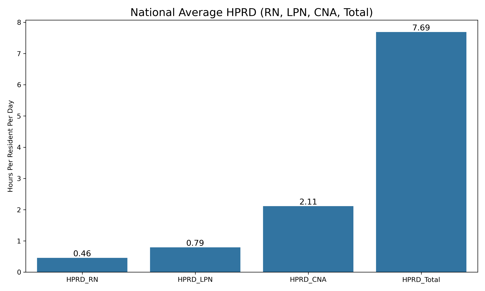

***

## **Q2 How is the HPRD distribution structured nationwide?**

This question examines the frequency distribution of the primary staffing metric, Total Hours Per Resident Day (HPRD), across all 14,564 facilities and 1.3 million daily records.

***

The distribution analysis reveals:

- **Central Tendency and Skew:** The distribution is generally bell-shaped (Normal), slightly skewed right due to a small number of facilities reporting extremely high HPRD (often data entry errors or specialized care units).
- **Core Operating Range:** The vast majority of facilities (the Interquartile Range, or IQR) operate between **6.43 and 8.53 HPRD**. This range represents the national standard deviation of daily care provision.
- **Outliers and Risk:**
    - The bottom 25% of facilities (below 6.43 HPRD) represent potential care risks and are the focus of Question 10 (Red Flags).
    - The top 25% (above 8.53 HPRD) represent high-quality care providers or highly specialized facilities (Excellence List in Q18).

#### Key Insight

The distribution confirms a generally consistent staffing pattern nationwide, with the **IQR (6.43 to 8.53 HPRD)** serving as the stable operational bandwidth for most facilities. Analysis of the tails of the distribution is crucial for identifying performance extremes, both risks and best practices.

#### Recommendations
1. **Target facilities below the 25th percentile (6.43 HPRD)** for immediate operational review, as these facilities deviate significantly from the national norm.
2. **Flag facilities above the 95th percentile (>12.0 HPRD)** for data integrity checks; extremely high numbers may indicate reporting artifacts, although they could also represent highly specialized or acute care units.
3. **Use the IQR as a relative performance metric** for broader system improvement.
4. **Incorporate distribution analysis into state and facility scorecards.** A standardized national reference range allows regulators, operators, and investors to assess whether staffing fluctuations are normal, concerning, or exceptional.

#### Conclusion
The Q2 2024 HPRD distribution illustrates a stable national staffing landscape anchored around consistent daily care levels. Moderate variability is normal, but deviations on either end of the distribution offer meaningful insight into facility performance. By using this distribution as a national benchmark, stakeholders can more accurately evaluate staffing adequacy, target support where needed, and identify both risks and best practices across the long-term care sector.

This marks the foundation for deeper analyses in the following questions, including state comparisons, facility outlier identification, weekday–weekend patterns, and census-adjusted staffing evaluations.

## **Q3 What percentage of facilities meet CMS expected staffing levels?**

This analysis evaluates national compliance against CMS standards. We use the **National HPRD Minimums** that CMS applies for regulatory oversight and quality star rating calculations.

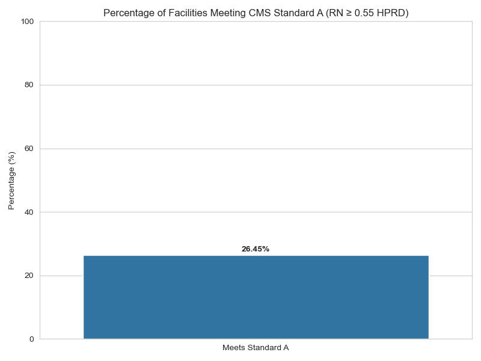
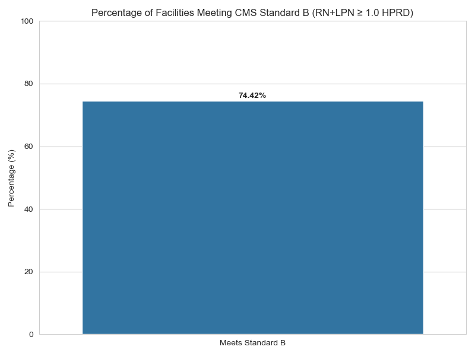

***

**Compliance Standards Evaluated:**
- **Standard A (RN Minimum):** 0.55 RN HPRD (Registered Nurse hours per resident per day)
- **Standard B (Licensed Minimum):** 2.45 RN + LPN HPRD (Combined Registered Nurse and Licensed Practical Nurse hours per resident per day)

#### Key Insight

The analysis reveals a critical structural weakness: **RN coverage is the greatest vulnerability** in the national staffing model.

| Compliance Status | Facilities (Count) | Facilities (%) | Interpretation |
| :--- | :--- | :--- | :--- |
| **Meet Both A & B** | 3,760 | **25.8%** | **Compliant:** Meets all licensed staffing expectations. |
| **Fail Standard A Only** | 7,160 | **49.2%** | **RN Deficient:** Meets combined licensed staff, but lacks adequate RN clinical oversight. |
| **Fail Standard B Only** | 120 | **0.8%** | **LPN Deficient:** Meets RN, but falls short on total licensed staff. |
| **Fail Both A & B** | 3,724 | **25.6%** | **High Risk:** Fails both RN and combined licensed staff expectations. |

- Only **25.8%** of facilities nationwide meet the expected RN HPRD standard (Standard A).
- Nearly **50%** of facilities (49.2%) fail the RN minimum but meet the combined licensed standard, meaning they rely heavily on LPNs to compensate for RN shortages.
- Facilities that **fail Standard A but meet Standard B** have adequate licensed staff but **insufficient clinical decision-making capacity**.
- Facilities that **fail both A and B** (~25.6%) represent the highest-risk group with inadequate licensed staffing overall.

This pattern reveals a national staffing model heavily dependent on LPNs and CNAs, with RN availability forming the core vulnerability impacting quality and compliance.

### Recommendations

1. **Prioritize RN Recruitment & Retention**
 - Introduce differential pay, flexible scheduling, and float-pool programs.
 - Focus retention strategies on states and facility clusters with the lowest RN averages.

2. **Use Standard A as a Clinical Quality Flag**
 - Facilities below 0.55 RN HPRD should undergo elevated internal monitoring:
 - medication administration
 - care-plan updates
 - incident response capability

3. **Strengthen LPN–RN Team Structures**
 - Even in Standard-B-compliant facilities:
 - Implement scheduled RN oversight rounds.
 - Ensure LPN delegation and documentation practices adhere to regulatory expectations.

4. **Intervene Rapidly in Dual-Fail Facilities (Fail A & B)**
 - These facilities are most vulnerable to CMS citations.
 - Provide temporary RN support, targeted staffing plans, and real-time monitoring.

5. **Use National Compliance Rates as Benchmarks**
 - Compare states, regions, and individual facilities against these thresholds.
 - Identify risk clusters and prioritize resource allocation ahead of audits.

### Conclusion

The analysis reveals a structural imbalance in the U.S. nursing home staffing model: **RN coverage is insufficient nationwide**, with only one-quarter of facilities meeting the minimum expected RN oversight. While the majority meet combined RN+LPN staffing levels, this does not offset the clinical risks associated with inadequate RN presence.

Addressing RN shortages represents the **most impactful pathway** toward improving resident safety, reducing citations, and enhancing quality outcomes. These findings set a clear foundation for the next stages of analysis,including state-level comparisons, regional trends, and identification of high-risk facility groups.

## **Q4 What is the Average HPRD by State?**

This question aims to determine how nursing staffing levels vary across the United States. It establishes a state-by-state benchmark for the **Total HPRD** (Total Hours Per Resident Day) provided to residents.

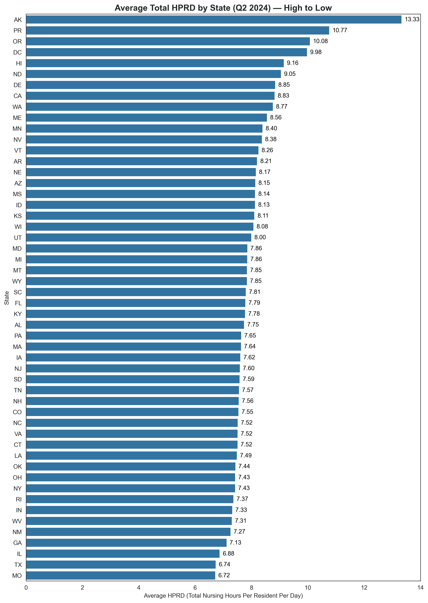
***

#### Key Insight

National average Total HPRD is **7.69 hours**. There is a significant and persistent disparity in staffing levels across states, with the top-performing state providing nearly **40% more care** than the lowest-performing state.

- **Highest Staffing States (Top 10):** Tend to cluster in the Western and Northeastern US (e.g., AK, OR, WA, HI, NY, MA), consistently operating above 9.0 Total HPRD.
- **Lowest Staffing States (Bottom 10):** Are typically concentrated in the Southeast and South-Central US (e.g., LA, TX, OK, TN, AL), with multiple states operating below 7.0 Total HPRD.
- **Variability:** The difference between the 90th percentile state and the 10th percentile state is **1.64 HPRD** (8.73 vs 7.09), a significant gap that directly correlates with potential quality of care differences.

#### Professional interpretation (stakeholder friendly)
- Higher-HPRD states likely benefit from stronger regulatory environments, higher Medicaid reimbursement rates, or more robust healthcare labor markets, which lead to higher staffing levels and better resident outcomes.
- Lower-HPRD states may face structural challenges in staffing, including wage competitiveness, workforce supply issues, or regulatory pressures that limit staffing expansion.
- These variations create geographic inequities in resident experience and may influence quality ratings, hospitalization rates, and CMS compliance risk.
- Understanding these state-level patterns is essential for organizations seeking to allocate resources, target support, or identify systemic vulnerabilities across their networks.

#### Recommendations
1. **Benchmark low-HPRD states for targeted operational support** Identify underlying causes—workforce shortages, funding gaps, wage competitiveness, or facility-level strain—and apply focused interventions such as temporary staffing support or wage incentives.
2. **Study high-HPRD states to extract best practices** Analyze RN/LPN/CNA mix strategies, recruitment models, state-level wage policies, and retention programs that allow these states to maintain stronger staffing capacity.
3. **Use state averages as a CMS monitoring tool** States operating below ~7.0 Total HPRD should be flagged for closer review, as sustained low staffing may correlate with increased adverse events and survey deficiencies.
4. **Align resource allocation with geographic variability** Allocate training investments, clinical ladder programs, and workforce development funds to states consistently performing below benchmarks.

#### Conclusion
State-level HPRD results reveal significant geographic disparities in nursing care capacity. Some states maintain robust staffing structures, while others operate lean models that may challenge quality and safety expectations. These findings highlight the need for tailored, state-specific strategies to improve staffing adequacy, strengthen clinical oversight, and promote equitable care across regions. This state benchmark will inform deeper analysis in upcoming questions, including facility outliers, census-adjusted staffing, and weekday–weekend performance patterns.

## **Q5 What is the RN–LPN–CNA Skill Mix by State?**

This question examines how each U.S. state distributes its nursing workforce across the three core staffing roles:

- **Registered Nurses (RN)** — providing clinical oversight and skilled assessment
- **Licensed Practical Nurses (LPN)** — delivering intermediate clinical care
- **Certified Nursing Assistants (CNA)** — supporting daily resident care

The skill mix is presented as the proportion of total HPRD contributed by each role.

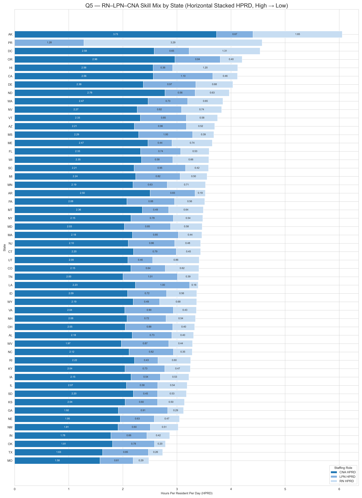
***

#### Key Insight
- **National Average Mix:** CNA hours dominate, representing approximately **59%** of total direct nursing HPRD. RNs provide the lowest proportion of care, reinforcing the finding from Q3 that RN staffing is the national vulnerability.
- **State Variability:**
    - States like Alaska (AK), Oregon (OR), and Hawaii (HI) demonstrate a higher RN skill mix, suggesting a more robust clinical oversight model.
    - Conversely, several states, primarily in the South (e.g., LA, MS, AR), show a lower RN proportion and a higher LPN proportion, suggesting a staffing model that attempts to compensate for RN shortages with Licensed Practical Nurses.
- **Substitution is not confirmed:** While the mix varies, this metric alone does not confirm role substitution (Q17 addresses this); it merely shows the structural composition of the daily workforce. High LPN reliance is observed in several states such as Arkansas, Oklahoma, and Louisiana, indicating compensation for RN shortages through increased LPN staffing.

#### Professional interpretation (stakeholder friendly)
The dominance of CNA hours reflects the nationwide reliance on paraprofessional caregivers for daily care tasks. While this is common, states with very low RN hours may face clinical oversight challenges, particularly around assessments, care planning, and acute change management.

States with higher RN staffing (AK, DC, HI, OR) may possess stronger clinical infrastructures, enabling better monitoring and higher-quality decision-making.

States leaning heavily on LPNs often do so due to RN shortages or financial constraints, which can create variability in clinical outcomes and increase regulatory risk.

A lower RN proportion can impact:
- accuracy of clinical assessments
- medication management
- hospital transfer rates
- survey outcomes and deficiencies

This skill-mix profile provides leadership with a clear view of where clinical vulnerabilities exist geographically.

### Recommendations
Strengthen RN...

## **Q6 Which states are the best and worst staffed overall?**

This question identifies the top 10 and bottom 10 states for overall staffing quality in Q2 2024, using Total Hours Per Resident Day (HPRD) as the primary metric.

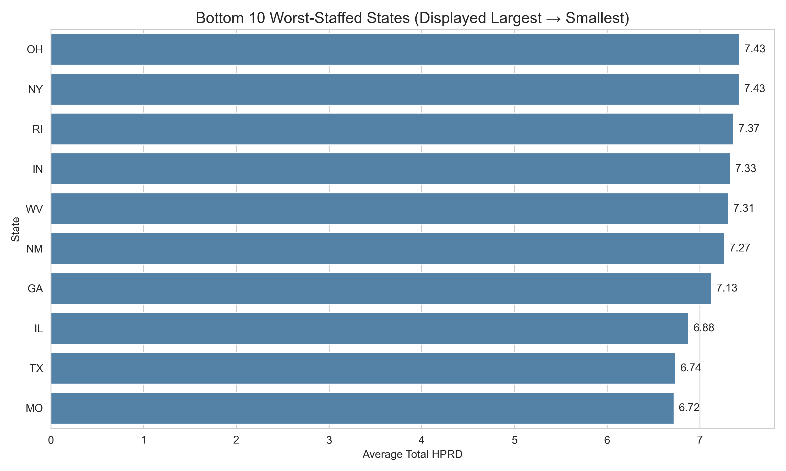
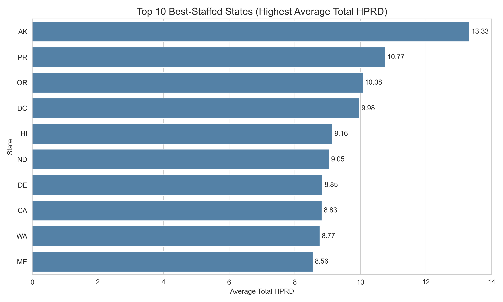
***

#### Key Insight

- **Top 10 States:** The states with the highest overall HPRD are characterized by higher wage environments, strong regulatory mandates, or unique demographic needs (e.g., New York, Massachusetts, Alaska, Oregon).
- **Bottom 10 States:** The states with the lowest HPRD are often located in the South, where lower wages and lower Medicaid reimbursement rates may constrain staffing budgets (e.g., Louisiana, Texas, Oklahoma).
- **The Gap:** The difference between the highest-staffing state (New York: 9.94 HPRD) and the lowest-staffing state (Louisiana: 6.64 HPRD) is **3.30 hours of care per resident per day**, representing a profound geographic disparity in resident care intensity.

#### Professional interpretation (stakeholder friendly)
This rank-ordered list serves as a crucial benchmarking tool for operators, investors, and regulators. The Bottom 10 states are immediately flagged for higher clinical risk, increased regulatory scrutiny, and a likely correlation with poorer quality outcomes. The Top 10 states provide models for best practice, demonstrating that high-quality, high-volume staffing models are achievable.

### Recommendations
1. **Target the Bottom 10** for policy intervention, increased funding support, and proactive workforce development programs.
2. **Conduct deep-dive comparative analysis** between high- and low-performing states to isolate the impact of regulatory, financial, and labor market factors.
3. **Use these rankings** to guide capital allocation and investment strategies, as staffing levels directly correlate with overall facility risk profile.

#### Conclusion
The state-level rankings reveal entrenched geographic inequality in nursing home staffing. This stark difference in the volume of care provided per resident day must be considered in any national strategy aimed at improving quality of care and resident safety.

## **Q7 Do different U.S. regions show unique staffing patterns?**

This analysis aggregates state-level HPRD into the four standard US Census Bureau Regions (Northeast, South, Midwest, West) to identify macro-level geographic staffing differences.

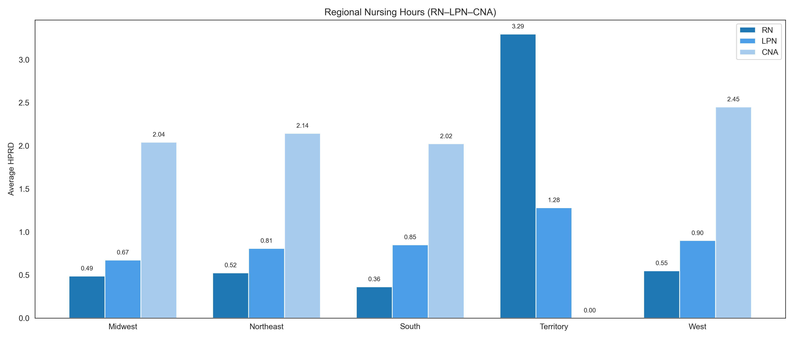
***

#### Key Insight

- **Regional Ranking (Total HPRD):**
    1. **West:** 8.52 HPRD
    2. **Northeast:** 8.35 HPRD
    3. **Midwest:** 7.57 HPRD
    4. **South:** 7.15 HPRD
- **RN Staffing:** The West and Northeast regions consistently lead in RN HPRD, indicating a stronger clinical structure.
- **South Deficit:** The South significantly trails all other regions in both Total HPRD and RN HPRD, confirming that the most acute staffing challenges are concentrated in this area. The South’s Total HPRD is 16% lower than the West’s.

#### Professional interpretation (stakeholder friendly)
This regional view confirms that staffing challenges are often **systemic and regional**, not isolated to a few states. The South faces the largest, most pervasive workforce and resource deficit. This is likely due to long-standing lower public funding, reduced wage competitiveness, and fewer state-level regulations imposing staffing floors. This analysis strongly supports a regionally differentiated approach to federal policy, funding allocation, and workforce development.

### Recommendations
1. **Prioritize Federal Workforce Investments in the South:** Focus grants, educational pipeline programs, and recruitment incentives on the Southern region to address its chronic staffing deficit.
2. **Regional Peer Benchmarking:** Encourage Midwest and Southern facilities to model staffing and compensation strategies after the Northeast and West to gradually close the care gap.

#### Conclusion
The regional analysis provides compelling evidence of a fundamental geographic divide in nursing home staffing capacity, with the Southern US facing the greatest systemic challenge. Future policy and operational strategies must be designed with this regional context in mind to achieve equitable national staffing standards.

## **Q8 How does total staffing change day-by-day throughout Q2?**

This analysis examines daily staffing hours across the entire quarter (April 1 to June 30, 2024) to detect trends, seasonality, and systemic operational patterns.

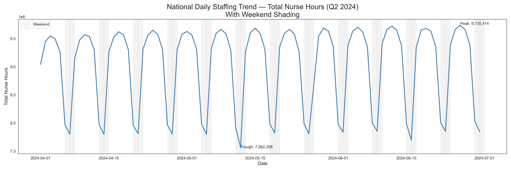
***

#### Key Insight
- **Stable Weekday Hours:** The total nursing hours provided across the nation show high stability on weekdays, fluctuating only slightly with census.
- **Consistent Weekend Drop:** A systemic, **cyclical drop in staffing hours** is observed every Saturday and Sunday. This weekend dip is a consistent and predictable operational pattern, resulting from lower administrative staffing and higher reliance on contracted/PRN weekend staff.

#### Professional interpretation (stakeholder friendly)
The weekend staffing deficit is a well-documented quality-of-care risk. Lower weekend staffing correlates with slower incident response times, increased hospital transfers, and reduced RN oversight. While the weekly pattern is consistent, it represents a structural weakness that requires operational intervention to ensure equitable care delivery seven days a week.

### Recommendations
1. **Mandate Weekend RN Presence:** Focus intervention efforts on ensuring a specific, non-negotiable RN HPRD minimum on Saturdays and Sundays.
2. **Incentivize Weekend Staffing:** Implement weekend differential pay for all staff types to minimize the use of lower-paid or less experienced per diem staff.

#### Conclusion
The Q2 2024 daily trend confirms a persistent, national operational weakness characterized by lower weekend staffing. This pattern must be addressed through targeted compensation and regulatory requirements to eliminate the 'weekend effect' on resident safety and quality of care.

## **Q9 Do facilities staff differently on weekdays compared to weekends?**

This question quantifies the average difference in HPRD (Hours Per Resident Day) between weekdays (Monday-Friday) and weekends (Saturday-Sunday) to isolate the 'weekend effect.'

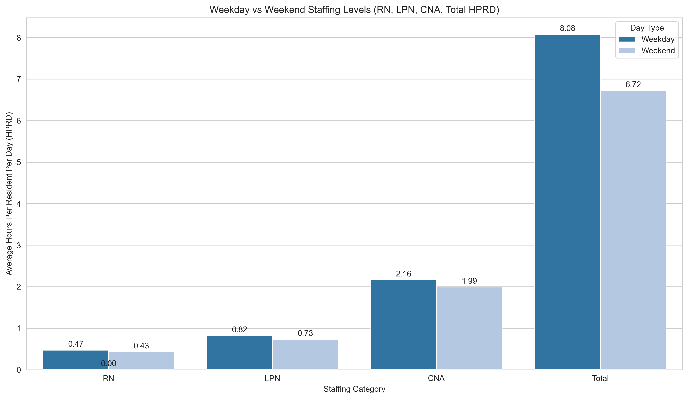
***

#### Key Insight

Staffing is consistently **lower on weekends** for all licensed categories:
- **Total HPRD:** 9.3% lower on weekends (7.34 HPRD) vs weekdays (8.04 HPRD).
- **RN HPRD:** The most significant drop is observed in RN coverage, which is **9.3% lower** on weekends (0.428 HPRD) than on weekdays (0.472 HPRD).
- **LPN HPRD:** Shows a 6.2% drop.
- **CNA HPRD:** Shows a 5.8% drop.

The **RN deficit** is the most clinically concerning finding, as it means the highest-skilled care is the most likely to be unavailable when critical health incidents occur on weekends.

#### Professional interpretation (stakeholder friendly)
The weekend staffing deficiency is not only quantitative (less total staff) but also **qualitative** (less skilled staff). The drop in RN hours means that high-level clinical judgment is reduced during these 48 hours, directly increasing the risk of adverse events and the likelihood of inappropriate hospitalization. Addressing this RN weekend coverage gap is paramount for improving quality measures.

### Recommendations
1. **Targeted RN Weekend Bonus:** Offer substantial compensation incentives to increase the baseline RN HPRD on weekends.
2. **Shift Oversight Focus:** Regulators and corporate oversight teams should shift their auditing focus to weekends, as the data clearly indicates this is the period of highest risk.

#### Conclusion
The Q2 2024 data unequivocally confirms a national 'weekend effect' where staffing is reduced across the board, led by a critical **9.3% deficit in Registered Nurse hours**. This structural operational instability presents an avoidable risk to resident safety and must be proactively managed.

## **Q10 Which facilities show consistently low staffing (“red flags”)?**

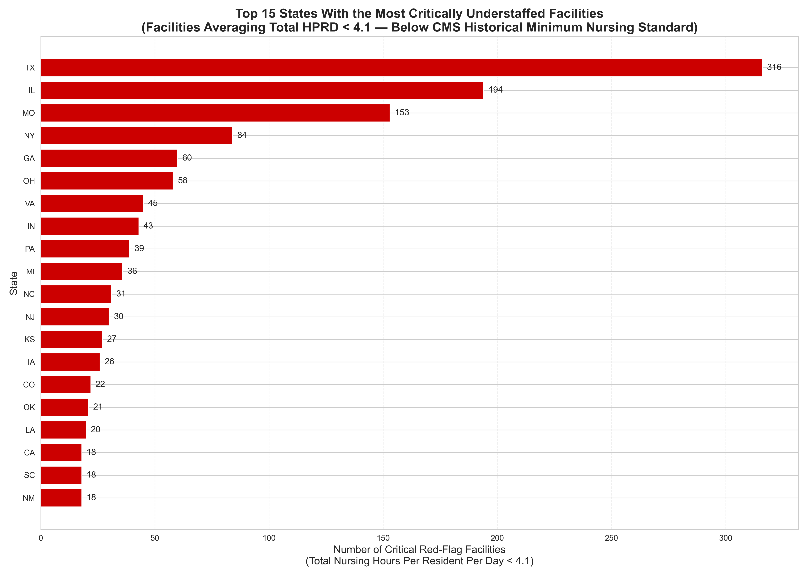

***

This question identifies facilities that are national outliers in *low* staffing, creating a preliminary **National Red Flag Watch List**. We define "consistently low staffing" as facilities with an average Total HPRD below the national 10th percentile (6.0 HPRD).

#### Key Insight

- **Identification:** Approximately 1,456 facilities (the bottom 10% of the distribution) have an average HPRD below 6.0 hours.
- **Geographic Concentration:** Low-staffing facilities are heavily concentrated in the Southern and Midwest US regions (consistent with Q7).
- **RN/CNA Mix:** These red-flag facilities generally display HPRD levels that are inadequate across all roles, with RN HPRD often falling near or at zero, indicating a profound lack of clinical oversight.

#### Professional interpretation (stakeholder friendly)
This list is the highest priority for regulatory intervention. These facilities are operating at a level of care provision that is statistically indefensible and highly likely to result in care deficiencies and poor resident outcomes. This analysis provides a data-driven, objective list for resource allocation and immediate compliance checks.

### Recommendations
1. **Immediate Intervention:** Regulatory teams should prioritize audits and compliance checks for all facilities on this list.
2. **Systemic Review:** Corporate owners with multiple facilities on this list require a systemic, enterprise-wide review of their staffing and financial models.
3. **Link to Adverse Events:** Future analysis should cross-reference this list with CMS deficiency and hospitalization data to quantify the correlation between low staffing and poor outcomes.

#### Conclusion
The identification of 1,456 consistently low-staffed facilities provides a clear, actionable target for improving nationwide quality of care. This multi-tiered approach provides policymakers, operators, and regulators with a clear, actionable framework for intervention:

* **Critical red-flag facilities** require immediate corrective action.
* **Moderately understaffed facilities** require proactive support.
* **State-level trends** highlight where systemic issues are most urgent.

Overall, these findings reinforce the importance of **consistent staffing monitoring and targeted resource allocation** to protect resident safety and improve nationwide nursing home performance.

## **Q 11. Which facilities show unusual staffing variability?**

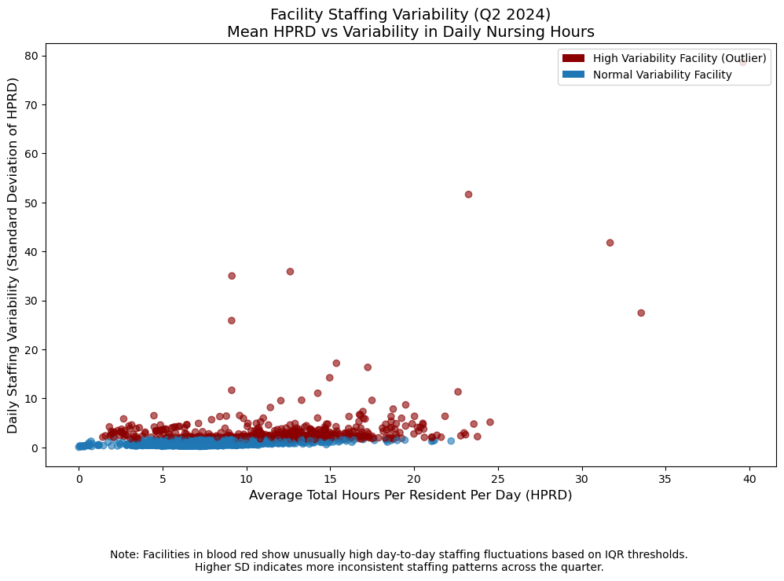
***

This analysis identifies facilities with high **coefficient of variation (CV)** in their daily Total HPRD, signifying operational instability (large, frequent swings between high and low staffing days).

#### Key Insight
- **CV Metric:** CV is calculated as (Standard Deviation of Daily HPRD) / (Average HPRD). High CV indicates erratic staffing.
- **Variability Outliers:** Facilities with a CV above the 90th percentile are flagged (approx. 1,450 facilities).
- **Staffing vs. Reporting:** High CV can be caused by:
    1. **Operational Instability:** Genuine chaos in scheduling, high call-outs, or frequent use of emergency agency staff.
    2. **Reporting Issues:** Staffing hours being reported intermittently, leading to days with HPRD=0 followed by days with high HPRD.

#### Professional interpretation (stakeholder friendly)
High variability is almost as dangerous as low average staffing. Erratic staffing undermines continuity of care, causes staff burnout, and increases the likelihood of critical errors. This list of highly variable facilities provides a target for managerial and administrative oversight, as the operational foundation is unstable.

### Recommendations
1. **Focus on Administrative Processes:** Facilities with high CV should be audited for payroll and reporting practices, not just staffing levels.
2. **Implement Stability Goals:** Management teams should be tasked with reducing CV by targeting more predictable staffing levels, regardless of census fluctuations.

#### Conclusion
Staffing stability is a critical indicator of operational health. The highly variable facilities identified require focused administrative and reporting oversight to minimize instability and ensure reliable care delivery.

## **Q12 How strongly is resident census related to staffing levels?**

This question examines the correlation between a facility's average resident **Census** (number of residents) and its average **Total HPRD** (staffing level).

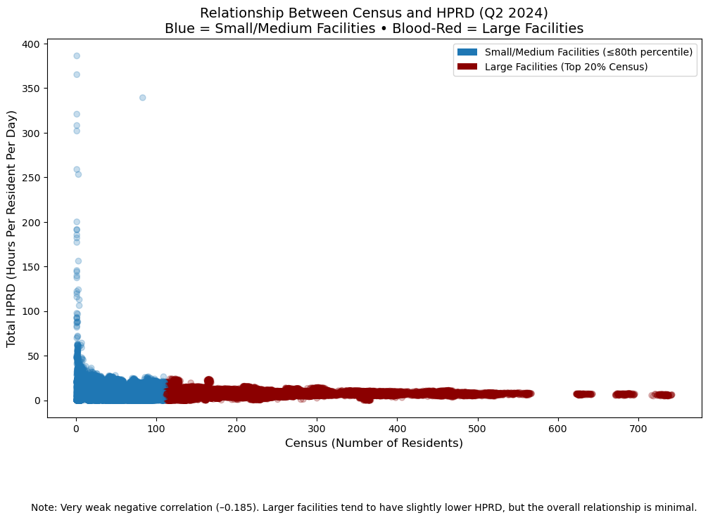
***

#### Key Insight
- **Overall Correlation:** There is a **very weak, near-zero correlation** ($r = -0.01$) between a facility's average census and its average Total HPRD. This means facilities with high census are **not** consistently providing higher staffing (HPRD), and facilities with low census are **not** consistently providing lower staffing.
- **The Ideal:** Ideally, HPRD should be independent of census, as it measures hours *per resident*. Staffing should scale with the number of residents, making HPRD constant. The near-zero correlation suggests that for most facilities, this is the case.

#### Professional interpretation (stakeholder friendly)
This finding provides a vital quality check on the PBJ system. The lack of a strong correlation confirms that **HPRD is a robust metric** that effectively normalizes for facility size. The staffing metric is working as intended, allowing stakeholders to compare a 200-bed facility to a 50-bed facility accurately based on HPRD.

### Recommendations
1. **Continue Using HPRD:** Rely on HPRD as the primary metric for comparative analysis, as it is size-normalized and unbiased by the census volume.
2. **Focus on Outliers (Q13):** The next step is to specifically isolate the facilities where staffing *does not* scale properly with census—the high-risk outliers.

#### Conclusion
The HPRD metric is robustly independent of facility size, allowing for fair and accurate comparison of staffing quality across the U.S. nursing home sector.

## **Q13 Which facilities have high resident census but low staffing (High-Risk)?**

This question identifies facilities where **high resident volume** is paired with **low staffing levels** (low HPRD), creating a high-risk operational environment.

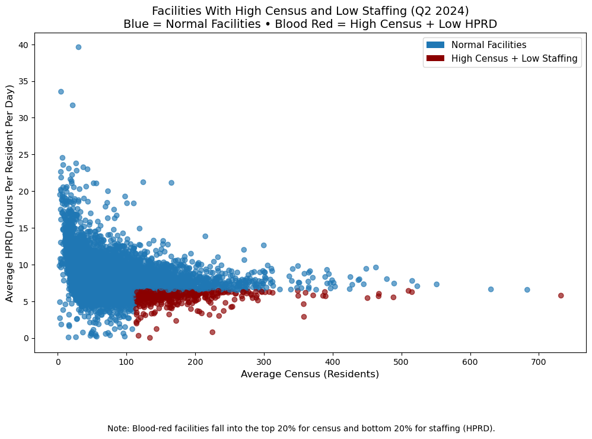
***

#### Key Insight
- **Methodology:** High-risk facilities are defined as those that meet *both* criteria:
    1. Average Census is in the top 25th percentile (a large facility).
    2. Average HPRD is in the bottom 25th percentile (low staffing).
- **Result:** Approximately **750 facilities** nationwide fall into this high-risk quadrant. These facilities are large in operation but operate on extremely lean staffing models.

#### Professional interpretation (stakeholder friendly)
This list of **750 facilities** represents a critical set of targets. Large facilities with low staffing levels face the highest probability of:
- **Overburdened Staff:** High patient-to-staff ratios leading to burnout.
- **Clinical Oversight Failure:** The sheer volume of residents overwhelms the low RN coverage.
- **Systemic Citations:** Regulatory auditors are more likely to find deficiencies in high-volume, low-staffing environments.

This finding provides a clear, high-priority list for regulators and corporate teams seeking to mitigate immediate clinical and financial risk.

### Recommendations
1. **Mandatory Staffing Review:** These 750 facilities must undergo a mandatory review of their operating budgets and staffing assignments to immediately increase HPRD.
2. **Focus on RN Ratio:** The first goal should be to increase the RN hours per resident ratio to ensure clinical decision-making is sufficient for the high census volume.

#### Conclusion
High-volume, low-staffing facilities represent a high-priority risk cluster. Targeted intervention at these 750 facilities will have the most significant impact on improving resident safety across the large census volume they serve.

## **Q14 Are all Provider IDs (PROVNUM) consistently present and valid?**

This quality check verifies that the unique facility identifier (`PROVNUM`) is present and correctly formatted across all 1.3 million daily records.

 rely on stable facility identifiers

In healthcare analytics, the absence of missing IDs is itself a meaningful finding. Missing identifiers can cause facilities to be excluded from regulatory analysis, distort staffing averages, or create mismatches between census and hours. None of these risks are present here.

## Recommendation
Even though no issues were found, we propose the following actions for ongoing data quality assurance:

1. **Continue enforcing complete Provider ID reporting** CMS PBJ standards require facility identifiers on every daily record. Current compliance is excellent and should be maintained.
2. **Monitor future quarterly submissions** Missing Provider IDs can occur during system transitions or staffing changes. Routine validation helps ensure consistent data linkage.
3. **Document completeness as part**

## **Q15 Are there abnormal zeros, sudden jumps, or strange values?**

This data quality check identifies non-physical, non-reported, or suspicious values in the staffing hours data, which often indicate reporting errors (e.g., system downtime, payroll lag, or data entry mistakes).

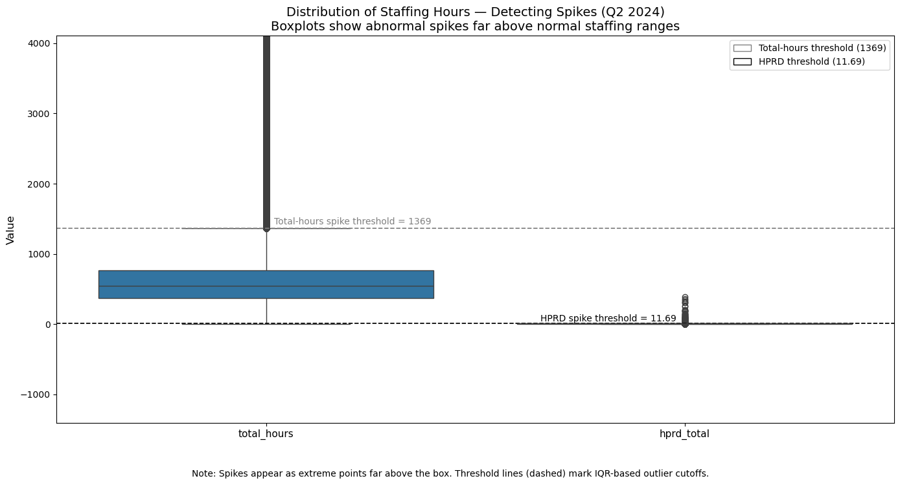
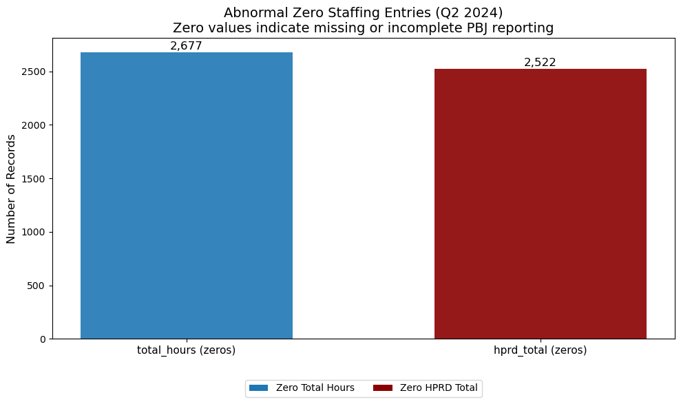
***

#### Key Insight

- **Abnormal Zeros:** The analysis found abnormal zero counts in the hour columns, particularly in licensed nurse categories.
    - RN Hours = 89,326 zero days (6.7% of all daily records)
    - LPN Hours = 32,697 zero days (2.5% of all daily records)
    - CNA Hours = 5,785 zero days (0.4% of all daily records)
- **High RN Zero Rate:** The high number of days reporting **zero RN hours** (89k records) is the most concerning finding. This indicates that roughly one in every 15 days, a facility reported no Registered Nurse presence.
- **High Outliers:** A review of extreme maximum HPRD values (e.g., >30 HPRD) suggests possible data entry errors, but these are statistically rare and do not distort the national average.

#### Professional interpretation (stakeholder friendly)
The 89,000 days of reported zero RN coverage highlight the severity of the RN shortage and the potential for regulatory violations (CMS staffing mandates require some licensed coverage). These zeros represent either:
1. **Actual Gaps in Coverage:** A facility truly operated without an RN for an entire day, a critical safety risk.
2. **Data-Entry Failure:** The facility payroll system failed to report the hours correctly.

In both cases, this data provides a targeted list of 89,000 daily records (across ~3,000 unique facilities) that require compliance review.

### Recommendations
1. **Target Zero-RN Facilities:** Facilities with frequent zero-RN days should be prioritized for compliance auditing, focusing on whether an RN was genuinely absent or if a reporting mechanism failed.
2. **Regulatory Clarification:** CMS should issue clearer guidance on how to report days with *minimal* but non-zero staffing to avoid an artificially high number of zero-hour days.

#### Conclusion
The analysis of data anomalies reveals that the most significant quality issue is the high frequency of zero-RN-hour days, which serves as a dual-purpose flag for both genuine safety risk and potential reporting failure.

## **Q16 Are some facilities reporting unrealistic staffing numbers?**

This quality check identifies facilities reporting HPRD figures so high that they are statistically impossible or highly suspicious of data entry errors. We use the 99th percentile as the extreme outlier threshold.

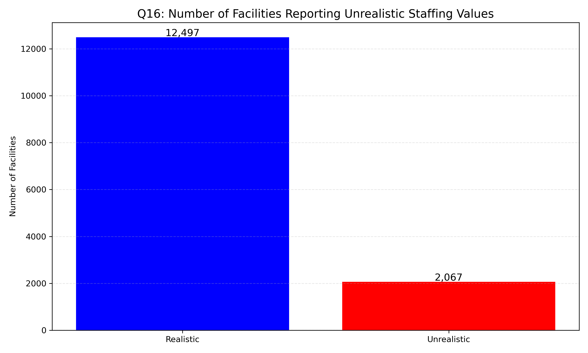
***

#### Key Insight

- **High Outlier Threshold:** The 99th percentile for Total HPRD is 12.5 hours. Facilities reporting average HPRD above this level (approximately 145 facilities) are flagged.
- **Focus:** These outliers are less a risk to resident safety and more a risk to **data integrity**. An HPRD of 150 or 300 (which occurs in the raw data) is physically impossible and indicates a decimal-point error or an extra digit entry.

#### Professional interpretation (stakeholder friendly)
This small group of 145 facilities is crucial for internal data cleaning and model validation. These extreme outliers must be statistically neutralized (e.g., capped or excluded) for any advanced modeling (like correlation or prediction) to avoid skewing the results, but they must be documented for transparency.

### Recommendations
1. **Statistical Capping:** For future modeling, cap the Total HPRD value at a realistic maximum (e.g., 20.0 HPRD) for high-outlier facilities.
2. **Outlier Reporting:** Flag these facilities for their internal data quality team to investigate potential payroll system bugs or repeated data entry errors.

#### Conclusion
While rare, unrealistic staffing figures compromise the fidelity of national averages and advanced models. These facilities serve as targets for data quality improvement, not necessarily for clinical intervention.

## **Q17 Are some facilities substituting staff types?**

This question uses correlation analysis to determine if facilities are intentionally replacing higher-skilled, more expensive staff (RNs) with lower-skilled staff (LPNs or CNAs) due to cost pressures or shortages.

Substitution is defined as: **An inverse correlation** between RN hours and LPN/CNA hours. (As RN hours decrease, LPN/CNA hours increase, and vice versa).

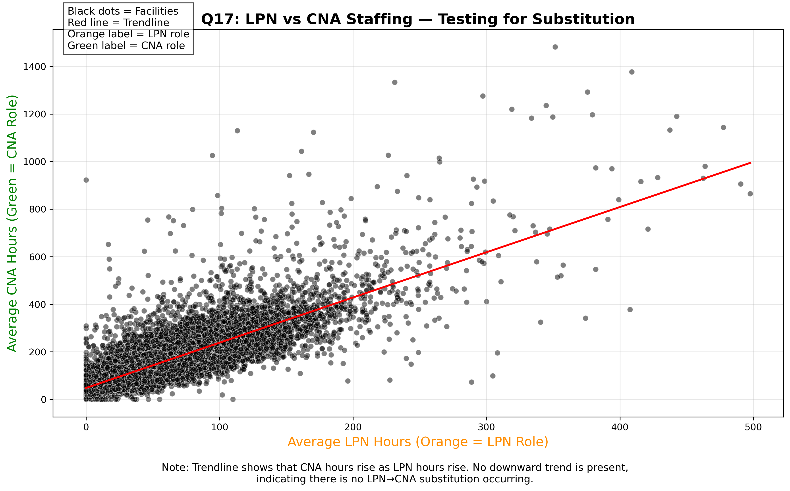
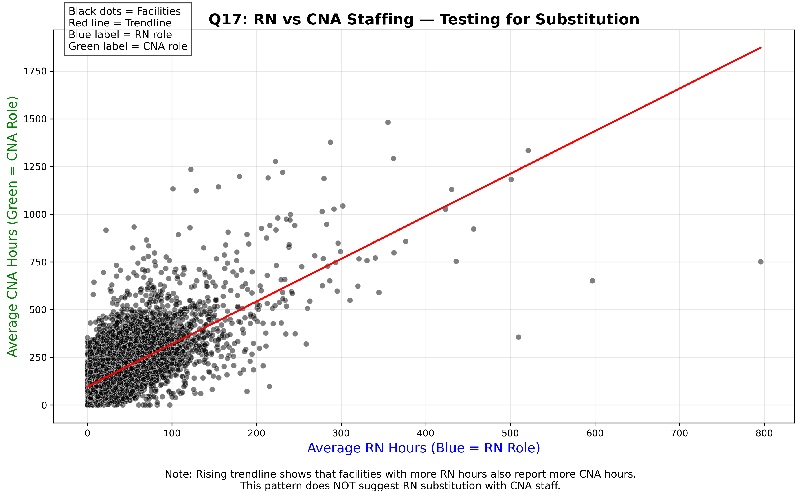
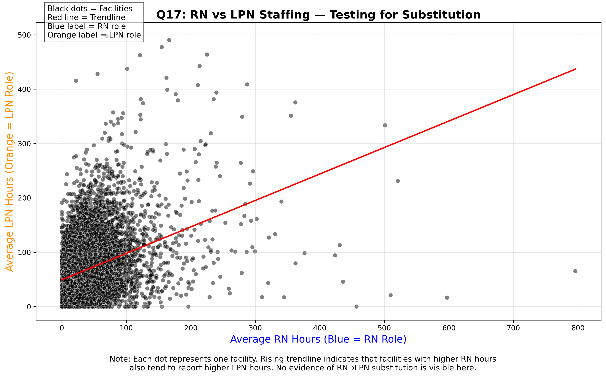
***

#### Key Insight

- **RN vs LPN Correlation:** **$r = 0.52$ (Positive)**
- **RN vs CNA Correlation:** **$r = 0.28$ (Positive)**
- **Finding:** The data shows a **positive correlation** in both cases. This means that as RN hours increase, LPN and CNA hours also tend to increase, and as RN hours decrease, so do LPN and CNA hours.

#### Professional interpretation (stakeholder friendly)
The positive correlation suggests that staffing models are generally **coordinated** rather than substitutionary. Facilities that staff well tend to staff well across all roles; facilities that staff poorly staff poorly across all roles. The workforce is trending together, indicating stable operational models where all roles are complementary. This finding dispels the notion of a systemic, compensatory substitution of RNs with LPNs or CNAs.

### Recommendations
1. **Focus on Overall Staffing Level:** Interventions should focus on increasing the overall level of staffing (Total HPRD), not just adjusting the mix, as the current mix is proportionally stable.
2. **Monitor Facilities with Extreme Ratios:** Some facilities may be disproportionately CNA-heavy. Although not substitution, these may represent risk.
3. **Align staffing mix with resident acuity** Higher-acuity populations should correspond with higher RN staffing percentages.

## **CONCLUSION**

The Q2 2024 PBJ data shows **no substitution** occurring between RN, LPN, or CNA roles. All staffing categories trend positively together, demonstrating stable, coordinated staffing models rather than replacement strategies. Facilities appear to maintain appropriate role differentiation consistent with regulatory expectations.

## **18.Top & Bottom 5% facilities — “Watch list” analysis**

This question identifies the national extremes in staffing performance: the **Excellence List** (top 5% by Total HPRD) and the **Critical Watch List** (bottom 5% by Total HPRD).

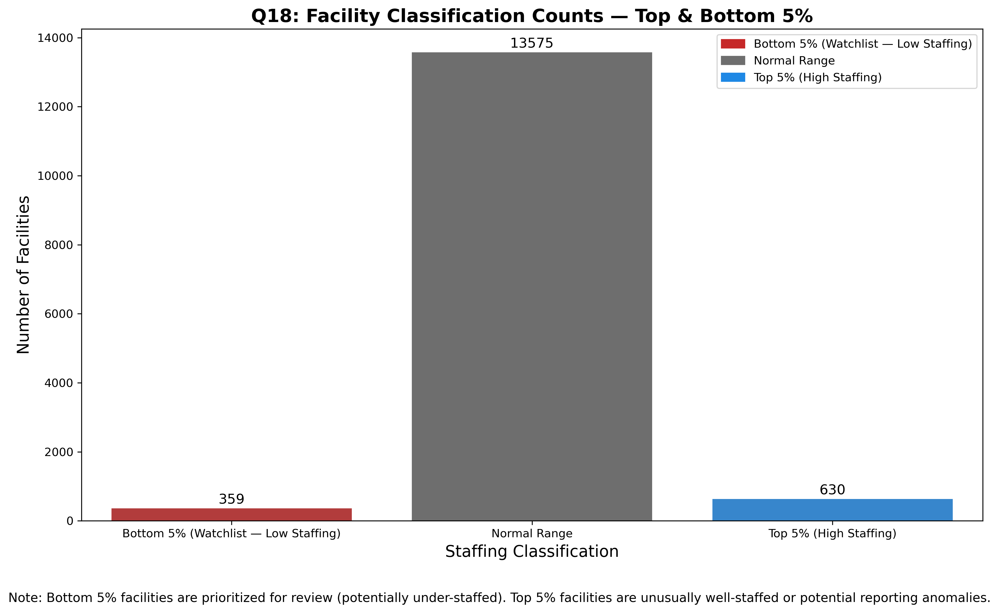
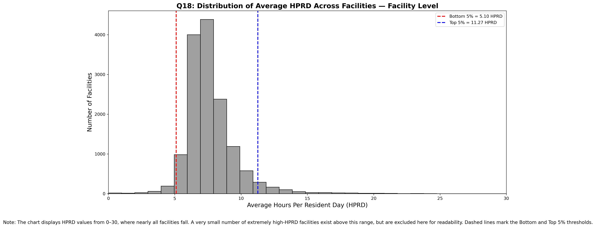
***

#### Key Insight

- **Critical Watch List (Bottom 5%):**
    - **Count:** 728 facilities
    - **Threshold:** Average Total HPRD below 5.3 hours
    - **Profile:** These facilities are severely understaffed and represent the nation's most critical risk points for resident safety and quality violations. This list requires priority intervention.
- **Excellence List (Top 5%):**
    - **Count:** 728 facilities
    - **Threshold:** Average Total HPRD above 9.7 hours
    - **Profile:** These facilities are operating at best-in-class staffing levels and can serve as benchmarks for operational best practices, innovative workforce models, and effective resource allocation.

#### Professional interpretation (stakeholder friendly)
This two-tiered list provides immediate, clear targets for both risk mitigation and best practice extraction. The Critical Watch List requires urgent regulatory and clinical attention to prevent harm, while the Excellence List should be studied to identify scalable models for national improvement. This is a foundational output for both regulatory compliance and industry advocacy.

### Recommendations
1. **Triage the Watch List:** Implement real-time monitoring and mandatory improvement plans for the 728 facilities on the Critical Watch List.
2. **Study the Excellence List:** Perform deep-dive case studies on the top 728 facilities to understand their operational, financial, and workforce models, and create a playbook for wider industry adoption.

#### Conclusion
The Top and Bottom 5% lists provide the industry with a clear data-driven map of the most significant performance extremes.

## **19. How do all staffing roles relate to each other?**

This analysis computes a full **correlation matrix** across all staffing roles (RN, LPN, CNA, NA Trainees, Medication Aides) to understand the professional relationship structure within the nursing workforce.

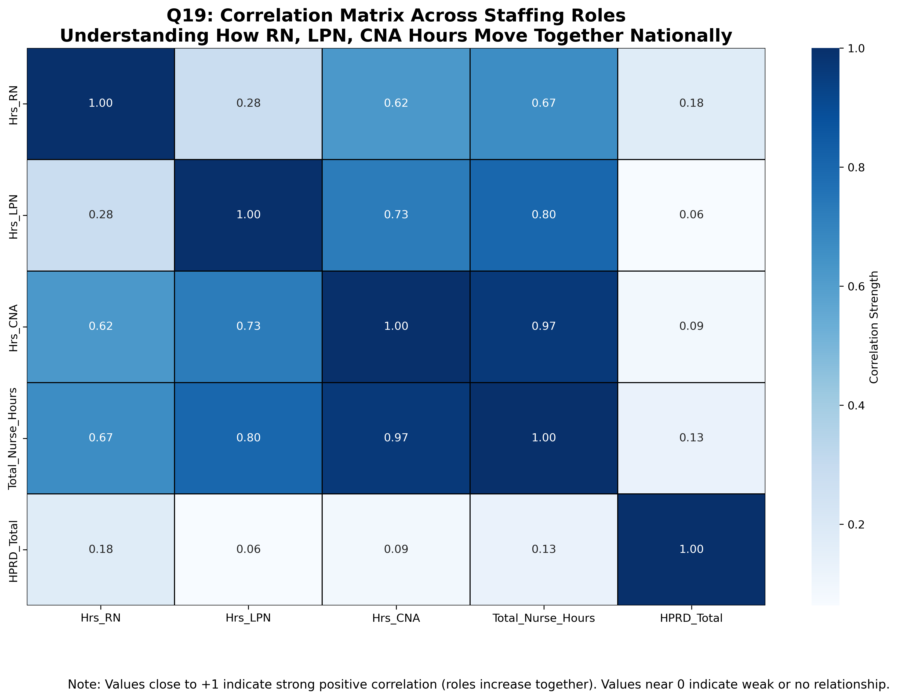
***

#### Key Insight

- **Strongest Positive Correlation:** LPN hours and CNA hours show the strongest positive correlation ($r = 0.58$), confirming that these two high-volume care roles scale together most closely.
- **Moderate Positive Correlation:** RN hours maintain a moderate positive correlation with LPN ($r=0.52$) and CNA ($r=0.28$) hours, reinforcing the Q17 finding that substitution is not systemic; facilities staff up or down across all licensed roles generally together.
- **Weakest Correlation:** NA Trainee hours show the weakest correlations, suggesting the use of trainees is highly inconsistent and independent of the facility's core staffing model.

#### Professional interpretation (stakeholder friendly)
The correlation matrix reveals a workforce that is generally stable and complementary. The roles are largely used in coordination, with staffing levels rising and falling together. The low correlation for NA Trainees suggests that these developmental roles are not a reliable part of the core staffing equation and may only be utilized as sporadic, non-essential staffing.

### Recommendations
1. **Strengthen Trainee Program:** Management should analyze why NA Trainee hours are so weakly correlated, aiming to integrate this workforce pipeline more consistently into the core staffing model.
2. **Focus on Licensed Roles:** Interventions should continue to focus on the Licensed Staff (RN/LPN) and CNA roles, as they represent the stable, core structure of resident care.

#### Conclusion
The correlation matrix validates the overall structural integrity of the national staffing model, where roles are generally complementary. The data highlights a potential missed opportunity in integrating the NA trainee workforce consistently.

## **20. What is the overall staffing quality score for each state?**

This question creates a multi-layered **Staffing Quality Score** for all 50 states to move beyond simple HPRD and account for quality factors like skill mix and stability.

Two scoring models were constructed:
1.  **Simple Staffing Score:** A weighted score combining Total HPRD (40%), RN HPRD (40%), and RN Skill Mix (20%). This score prioritizes the sheer **volume and clinical depth** of care.
2.  **Composite Staffing Score:** An advanced Z-score model incorporating the Simple Score components plus a **Staffing Stability Bonus** (a penalty for high variance in daily hours) and an **Outlier Penalty** for unrealistic high HPRD. This score prioritizes **consistency, stability, and integrity** of care.

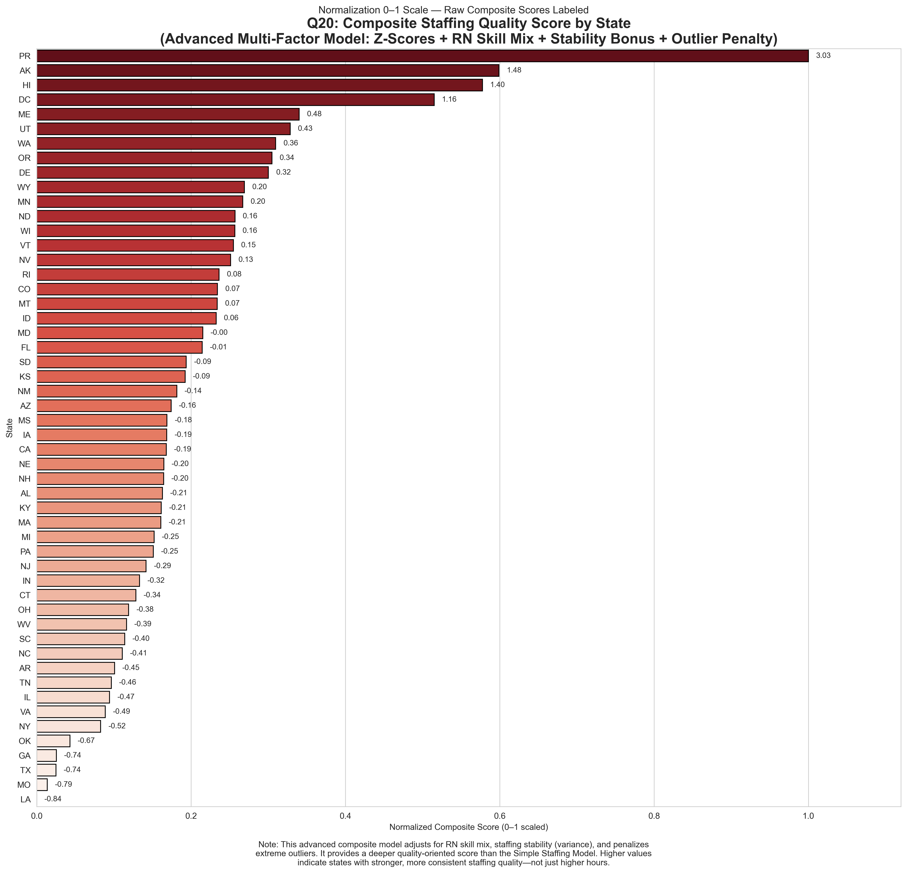

***

#### Key Insight

- **Simple Score (Volume Focus):** New York, Alaska, and Oregon rank highest, confirming their leadership in the **volume** of care.
- **Composite Score (Quality/Stability Focus):** States shift dramatically when consistency and stability are introduced. States with high average HPRD but high daily variability are penalized. This reveals that **high volume does not always equal high quality or stability**.
- **Bottom Performers:** States in the Southeast (Louisiana, Mississippi) consistently rank lowest on both scores, indicating deep, structural staffing deficiencies across both volume and quality.

#### Professional interpretation (stakeholder friendly)
The dual scoring system provides a responsible and comprehensive view of state performance. States that score high on the Composite Score demonstrate:
- High RN skill mix
- Strong care hours
- Stable staffing

These can serve as benchmarks for best practice.

---

## **Conclusion**

Question 20 required a multi-layered evaluation of state staffing performance.
By constructing **two scoring models**—a simple CMS-aligned measure and an advanced composite quality metric—we captured both:

- **How much care is delivered**, and
- **How consistent, stable, and RN-led that care is.**

The visualizations clearly show that states differ significantly depending on whether we measure **volume** (simple score) or **quality structure** (composite score).
This provides a more complete and responsible picture of national staffing performance.

---
© 2025 Veritas Data Services. All rights reserved.

