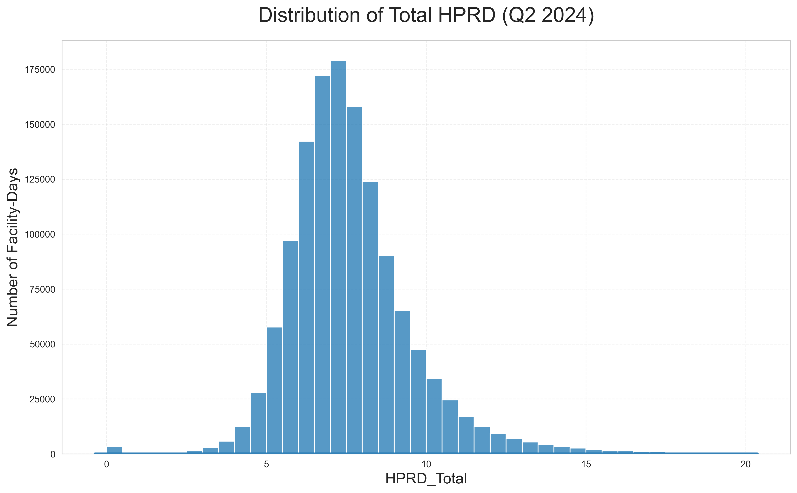
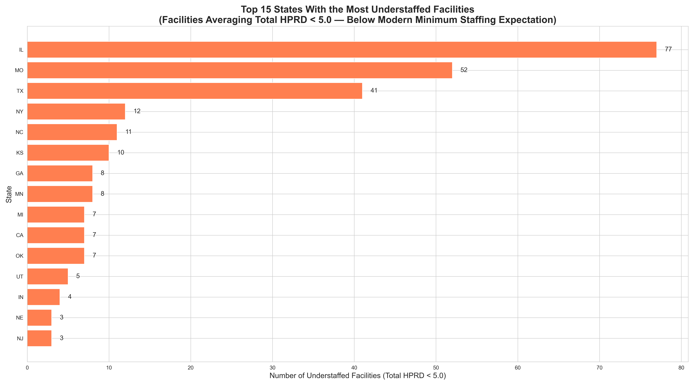
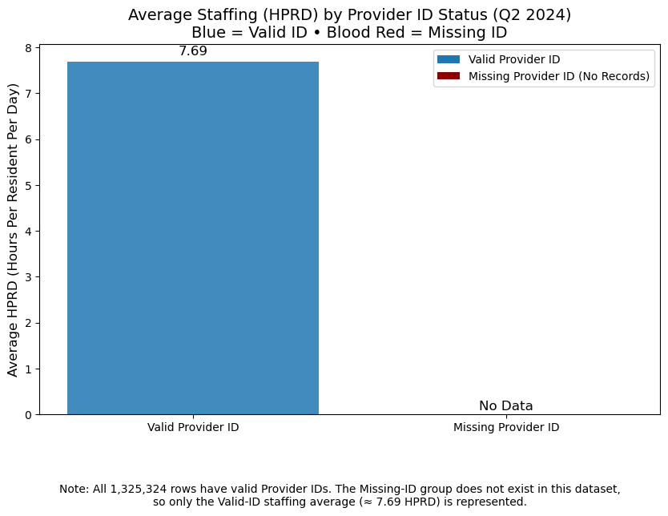

# Veritas Data Services
## PBJ Daily Nurse Staffing-Q2 2024 (CMS)
### Project Introduction & Analysis Plan

The Payroll-Based Journal (PBJ) Daily Nurse Staffing Q2 2024 dataset, published by the Centers for Medicare & Medicaid Services (CMS), provides facility-level daily staffing and census data for U.S. nursing homes. This dataset is essential for regulatory oversight, quality measurement, and staffing compliance evaluation.

This project, conducted by Veritas Data Services, transforms this large administrative dataset into clear, actionable insights that help stakeholders understand staffing levels, operational patterns, and care delivery risks across facilities.
## Project Files & Technical Documentation

 **1. Data Cleaning & Preparation Notebook**
File: **PBJ_Daily_Nurse_Staffing_Q2_2024_Cleaning_Pipeline.ipynb**

This notebook contains the full data engineering workflow, including:
* Raw PBJ Q2 2024 data loading
* Data type corrections
* Missing value assessments
* Outlier detection and handling
* Creation of all derived staffing metrics (**HPRD**, **skill-mix ratios**, **composite features**)
* Validation checks (**zero-hours**, **unrealistic values**, **consistency validation**)
* Final cleaned dataset export used for all analysis and charts

This is the official **source of truth** for the dataset used in the entire project.

 **2. Full Analysis & Visualization Notebook**
File: **PBJ_Daily_Nurse_Staffing_Q2_2024_Final.ipynb**

This notebook contains:
* All **20 analytical questions**
* Full Python code, EDA, and computation steps
* The formulas and calculations used to derive all insights
* All chart generation code (**Q1–Q20**)
* The final analytical interpretations behind each finding
* Regulatory reasoning, workforce logic, and quality implications

This notebook represents the complete **analytical engine** of the project giving more depth to all the insights presented in the README.

**Usage Note for Reviewers**
Both notebooks are included so that stakeholders, auditors, and collaborators can:

* **Validate calculations**
* **Reproduce results**
* **Review all transformations** from raw CMS PBJ data to final insights
* **Inspect code quality**, methodological consistency, and analytic rigor

# References
- Veritas Data Services. *PBJ Daily Nurse Staffing – Q2 2024 Cleaning Pipeline.* Jupyter Notebook.  
- Veritas Data Services. *PBJ Daily Nurse Staffing – Q2 2024 Full Analysis & Visualization.* Jupyter Notebook.  
- Centers for Medicare & Medicaid Services (CMS). Payroll-Based Journal (PBJ) Daily Nurse Staffing Data, Q2 2024 Release.

# Dataset Overview

After extraction and cleaning, the dataset contains:

- Total Rows: 1,325,324
- Total Columns: 33
- Quarter Covered: 2024 Q2 (April 1-June 30)
- Facilities Represented: 14,564
- Reporting Frequency: Daily per facility
- Source: CMS PBJ Daily Nurse Staffing Data

The dataset includes:
- Facility identifiers (PROVNUM, PROVNAME, CITY, STATE, COUNTY)
- Daily census (MDScensus)
- Daily staffing hours for RN, LPN, CNA, Nurse Aides in Training, Medication Aides
- Employee vs Contract hours
- Derived metrics including Total Hours and HPRD (Hours per Resident Day)

# Analysis Framework

The analysis is organized into 20 professional, stakeholder-focused questions designed to capture staffing sufficiency, state-level patterns, outliers, workforce mix, and operational risks.

These insights support decision-making for:
- CMS quality analysts
- Nursing home administrators
- Healthcare investors
- Staffing directors
- Policy and regulatory teams

# PBJ Daily Nurse Staffing-Q2 2024
## Official Analysis Questions (Stakeholder-Friendly Version)

Below are the key questions this analysis will answer. These questions are written in clear, non-technical language so that any reader including non-analysts can understand the purpose and value of each part of the study.

# NATIONAL STAFFING LEVELS

### **1. What is the national average amount of nursing care each resident receives per day?**
(We will calculate the Hours Per Resident Day-HPRD for RN, LPN, CNA, and Total.)

### **2. How are staffing levels distributed across all nursing homes nationwide?**
(Are most facilities low, average, or high in the amount of care they provide?)

### **3. What percentage of facilities meet or fall below expected staffing requirements?**
(Helps identify whether staffing is generally adequate across the country.)

# STATE & REGIONAL COMPARISONS

### **4. How do average staffing levels differ from state to state?**
(Some states may consistently staff better or worse than others.)

### **5. What does each state’s skill mix look like?**
(How much care comes from RNs vs LPNs vs CNAs in each state?)

### **6. Which states are the best and worst staffed overall?**
(Top 10 and bottom 10 states based on total HPRD.)

### **7. Do different U.S. regions show unique staffing patterns?**
(Northeast vs South vs Midwest vs West.)

# FACILITY-LEVEL OPERATIONS

### **8. How does total staffing change day-by-day throughout Q2?**
(We will look at trends from April to June.)

### **9. Do facilities staff differently on weekdays compared to weekends?**
(A common quality-of-care issue.)

### **10. Which facilities show consistently low staffing (“red flags”)?**
(Facilities at the bottom of national staffing levels.)

### **11. Which facilities show unusual spikes or drops in staffing?**
(These may indicate reporting issues or operational instability.)

# CENSUS & STAFFING RELATIONSHIP

### **12. How strongly is resident census related to staffing levels?**
(Are high-census facilities providing enough care?)

### **13. Which facilities have many residents but low staffing?**
(These will be highlighted as high-risk facilities.)

# DATA QUALITY & REPORTING CHECKS

### **14. Do facilities with missing or invalid Provider IDs show different staffing patterns?**
(This helps detect reporting problems.)

### **15. Are there abnormal zeros, sudden jumps, or strange values?**
(Such anomalies often reveal reporting errors.)

### **16. Are some facilities reporting unrealistic staffing numbers?**
(We check for impossible or suspicious patterns.)

# ADVANCED STAFFING ANALYTICS

### **17. Are some facilities substituting staff types?**
(Example: Using more CNAs instead of RNs or vice versa.)

### **18. Which facilities fall in the top and bottom 5% of staffing quality?**
(Creating a national “watch list” and “excellence list.”)

### **19. How do all staffing roles relate to each other?**
(Full correlation matrix across RN, LPN, CNA, NA trainees, Med Aides.)

### **20. What is the overall staffing quality score for each state?**
(A composite metric combining staffing levels, mix, and consistency.)

These 20 questions give a complete, multi-angle understanding of staffing quality,
operations, integrity, and risk across the entire United States nursing home sector
for Q2 2024.

***

## **Question 1 What is the National Average HPRD?** This analysis answers a core staffing question:

**What is the national average number of nursing care hours provided per resident per day**, broken down by:
- **RN HPRD** (Registered Nurse hours per resident per day)
- **LPN HPRD** (Licensed Practical Nurse hours per resident per day)
- **CNA HPRD** (Certified Nursing Assistant hours per resident per day)
- **Total HPRD** (Combined RN + LPN + CNA hours per resident per day)

This national benchmark helps stakeholders understand overall staffing sufficiency across all U.S. nursing facilities in Q2 2024 and sets the foundation for state comparisons, facility outlier detection, and compliance monitoring.

***

## **Key Insight**
**National average HPRD (Q2 2024):**

**RN: 0.46 HPRD**
**LPN: 0.79 HPRD**
**CNA: 2.11 HPRD**
**Total (all nursing roles): 7.69 HPRD**
**CNAs** provide the majority of direct resident care, contributing more than 2.1 hours per resident per day-roughly triple the combined RN and LPN hours.

**RN** coverage is the lowest by a substantial margin, reflecting persistent national RN shortages in long-term care.

The national total HPRD of 7.69 is above basic historical minimums but suggests a lean staffing model where RN clinical oversight is limited.

Professional interpretation (stakeholder friendly)
The national staffing mix shows a system that relies heavily on CNAs for hands-on care while RNs are providing limited direct hours. This distribution is indicative of:
Operational trade-offs: facilities are prioritizing coverage and direct assistance (CNA hours) over higher-skill RN hours, likely for cost and supply reasons.
Clinical risk concentration: limited RN time per resident may reduce opportunities for proactive clinical assessment, care-plan updates, and early intervention for deteriorating residents.
Workforce pressure: CNAs carry a significant workload which increases the risk of burnout, staff turnover, and variability in care quality.
These national averages establish a neutral benchmark that should be used to compare states, regions, and individual facilities to detect meaningful under- or over-staffing patterns.

## **Recommendations (actionable, prioritized)**
Increase RN coverage where feasible

Target a phased RN staffing uplift in facilities that fall materially below the national RN average. Even modest increases in RN HPRD can reduce adverse events and hospital transfers.
Short-term: hire part-time RNs or contract clinical supervisors for peak periods.
Medium-term: invest in RN retention (career ladders, education stipends, schedule flexibility).
Protect CNA capacity and reduce burnout risk

Implement scheduling best practices (predictable shifts, limits on overtime) and formal workload monitoring.
Introduce retention measures: competitive pay bands, recognition programs, and clear career progression to LPN/RN pathways.
Use national averages as an operational benchmark

Compare each facility and state to these national HPRD values to prioritize audits and targeted support.
Flag facilities with low RN HPRD or extreme CNA:LPN:RN imbalances for immediate operational review.
Measure outcomes tied to staffing changes

Track key outcomes (falls, hospital transfers, medication errors, survey citations) before and after staffing interventions to quantify clinical and financial return on investment.

## **Conclusion**
The national HPRD profile shows adequate total nursing hours but a pronounced skills-mix imbalance with low RN presence and heavy reliance on CNAs. This creates both operational efficiencies and clinical vulnerabilities. Using the national averages as a baseline, Veritas Data Services recommends a combined approach: modest RN staffing increases, proactive CNA support and retention, plus data-driven targeting of facilities and states that fall short of safe staffing practice. These steps will better align staffing with quality objectives and reduce systemic risk.

Notes for reporting and follow-up
Use these national figures as the baseline for the next analyses: state comparisons, facility outlier detection, weekday/weekend splits, and staffing-versus-census correlations.
When reporting to stakeholders, present RN, LPN, and CNA HPRD together with outcome indicators to make the case for targeted investment in clinical staffing.

## **Q2 How is the HPRD distribution across all facilities**

This question examines the frequency distribution of the primary staffing metric, Total Hours Per Resident Day (HPRD), across all 14,564 facilities and 1.3 million daily records.

***

## **Key Insight**
The national distribution of Total Hours Per Resident Per Day (HPRD) in Q2 2024 shows a strong and consistent pattern across U.S. nursing facilities. Most facility-days fall between 6 and 10 HPRD, with the highest concentration around 7–8 hours per resident per day. This confirms that while staffing levels vary by facility, the national system operates within a relatively predictable range.

The distribution is slightly right-skewed, meaning there are more facilities operating below 10 HPRD than above it. Very few facility-days exceed 12 HPRD, and extremely high values are rare, indicating that only a small number of facilities staff significantly above the national norm. The lower tail (0–3 HPRD) exists but represents a very small share of all facility-days, suggesting isolated operational disruptions, reporting anomalies, or exceptional circumstances rather than systemic under-staffing.

Overall, the distribution reflects a stable industry-wide staffing pattern where most facilities provide a moderate level of daily care, with controlled variation across the sector.

**Professional Interpretation (Stakeholder-Friendly)**
This distribution tells a clear national story:
Facilities generally staff at levels that support baseline operational care but may lack flexibility for unexpected clinical or operational demands. The clustering around 7–8 HPRD suggests a standardized approach to daily staffing nationwide, influenced by historical norms, reimbursement structures, and workforce availability.

The right-skew indicates a small percentage of high-performing or high-resourced facilities providing enhanced staffing. These facilities may experience better clinical outcomes, lower turnover, and fewer deficiencies, underscoring the potential performance gap between average and top-tier providers.

Meanwhile, the small pocket of low-HPRD days highlights potential risk zones. Even if infrequent, such dips can be early indicators of staffing instability—often preceding regulatory citations, quality issues, or increased resident safety incidents.

This national distribution therefore forms the foundation for detecting outliers, benchmarking states, and identifying facilities that consistently fall below expected staffing patterns.

## **Recommendations (Actionable & Prioritized)**
Use the national peak range (7–8 HPRD) as a benchmark for facility evaluations.
Facilities consistently below this range should undergo operational review to understand staffing constraints or systemic inefficiencies.

Investigate repeated low-HPRD days (<4 HPRD).
While rare, recurring low staffing days may signal compliance risks, workforce shortages, or reporting errors that require intervention.

Highlight top-performing high-HPRD facilities as models.
These facilities can inform workforce planning, staffing structure, and resource allocation strategies for broader system improvement.

Incorporate distribution analysis into state and facility scorecards.
A standardized national reference range allows regulators, operators, and investors to assess whether staffing fluctuations are normal, concerning, or exceptional.

## **Conclusion**
The Q2 2024 HPRD distribution illustrates a stable national staffing landscape anchored around consistent daily care levels. Moderate variability is normal, but deviations on either end of the distribution offer meaningful insight into facility performance. By using this distribution as a national benchmark, stakeholders can more accurately evaluate staffing adequacy, target support where needed, and identify both risks and best practices across the long-term care sector.

This marks the foundation for deeper analyses in the following questions, including state comparisons, facility outlier identification, weekday–weekend patterns, and census-adjusted staffing evaluations.

## **Q3 What percentage of facilities meet CMS expected staffing levels?**

This analysis evaluates national compliance against CMS standards. We use the **National HPRD Minimums** that CMS applies for regulatory oversight and quality star rating calculations.

***

## **Key Insight**
**CMS evaluates facilities using two staffing expectations:**

**Standard A: RN HPRD ≥ 0.55**
(Minimum registered nurse coverage for safe clinical oversight)

**Standard B: RN + LPN HPRD ≥ 1.0**
(Minimum licensed nursing coverage per resident per day)

Q3 2024 National Results

26.45% of facilities meet Standard A
→ Only about one in four homes provide the minimum RN coverage.
74.42% meet Standard B
→ Nearly three out of four meet licensed nursing requirements when RN and LPN hours are combined.
Interpretation for Stakeholders

RN staffing is the primary national gap. RN hours are consistently low across facilities, limiting clinical oversight capacity.
LPN staffing compensates for RN shortages. Many facilities only meet Standard B because LPN hours are strong enough to elevate total licensed coverage.
Facilities that fail Standard A but meet Standard B have adequate licensed staff but insufficient clinical decision-making capacity.
Facilities that fail both A and B (~25.6%) represent the highest-risk group with inadequate licensed staffing overall.
This pattern reveals a national staffing model heavily dependent on LPNs and CNAs, with RN availability forming the core vulnerability impacting quality and compliance.

## **Recommendations**
Prioritize RN Recruitment & Retention

Introduce differential pay, flexible scheduling, and float-pool programs.
Focus retention strategies on states and facility clusters with the lowest RN averages.
Use Standard A as a Clinical Quality Flag

Facilities below 0.55 RN HPRD should undergo elevated internal monitoring:
medication administration
care-plan updates
incident response capability
Strengthen LPN–RN Team Structures

Even in Standard-B-compliant facilities:
Implement scheduled RN oversight rounds.
Ensure LPN delegation and documentation practices adhere to regulatory expectations.
Intervene Rapidly in Dual-Fail Facilities (Fail A & B)

These facilities are most vulnerable to CMS citations.
Provide temporary RN support, targeted staffing plans, and real-time monitoring.
Use National Compliance Rates as Benchmarks

Compare states, regions, and individual facilities against these thresholds.
Identify risk clusters and prioritize resource allocation ahead of audits.

## **Conclusion**
The analysis reveals a structural imbalance in the U.S. nursing home staffing model:
RN coverage is insufficient nationwide, with only one-quarter of facilities meeting the minimum expected RN oversight. While the majority meet combined RN+LPN staffing levels, this does not offset the clinical risks associated with inadequate RN presence.

Addressing RN shortages represents the most impactful pathway toward improving resident safety, reducing citations, and enhancing quality outcomes. These findings set a clear foundation for the next stages of analysis,including state-level comparisons, regional trends, and identification of high-risk facility groups.

## **Q4 What is the Average HPRD by State?**

This question aims to determine how nursing staffing levels vary across the United States. It establishes a state-by-state benchmark for the **Total HPRD** (Total Hours Per Resident Day) provided to residents.

***

## **Key Insight**
Average Total HPRD varies sharply across states, ranging from 6.72 to 13.33, showing wide differences in staffing capacity and care delivery models across the country.
Alaska (13.33), Puerto Rico (10.77), Oregon (10.08), and Washington D.C. (9.98) report the highest Total HPRD, indicating stronger staffing structures and higher nursing coverage per resident.
States such as Missouri (6.72), Texas (6.74), Illinois (6.88), and Georgia (7.13) operate with leaner staffing models, which may reflect shortages in the nursing workforce, financial constraints, or regional policy differences.
Med Aide and Nurse Aide Trainee roles reported zero hours nationwide, meaning Total HPRD reflects only RN, LPN, and CNA contributions in Q2 2024.
Professional interpretation (stakeholder friendly)
Higher-HPRD states demonstrate consistent investment in nursing resources, which may translate to stronger clinical oversight, lower care delays, and better resident outcomes.
Lower-HPRD states may face structural challenges in staffing, including wage competitiveness, workforce supply issues, or regulatory pressures that limit staffing expansion.
These variations create geographic inequities in resident experience and may influence quality ratings, hospitalization rates, and CMS compliance risk.
Understanding these state-level patterns is essential for organizations seeking to allocate resources, target support, or identify systemic vulnerabilities across their networks.

## **Recommendations**
Benchmark low-HPRD states for targeted operational support
Identify underlying causes—workforce shortages, funding gaps, wage competitiveness, or facility-level strain and apply focused interventions such as temporary staffing support or wage incentives.

Study high-HPRD states to extract best practices
Analyze RN/LPN/CNA mix strategies, recruitment models, state-level wage policies, and retention programs that allow these states to maintain stronger staffing capacity.

Use state averages as a CMS monitoring tool
States operating below ~7.0 Total HPRD should be flagged for closer review, as sustained low staffing may correlate with increased adverse events and survey deficiencies.

Align resource allocation with geographic variability
Allocate training investments, clinical ladder programs, and workforce development funds to states consistently performing below benchmarks.

## **Conclusion**
State-level HPRD results reveal significant geographic disparities in nursing care capacity. Some states maintain robust staffing structures, while others operate lean models that may challenge quality and safety expectations. These findings highlight the need for tailored, state-specific strategies to improve staffing adequacy, strengthen clinical oversight, and promote equitable care across regions. This state benchmark will inform deeper analysis in upcoming questions, including facility outliers, census-adjusted staffing, and weekday–weekend performance patterns.

## **Q5 What is the RN–LPN–CNA Skill Mix by State?**

This question examines how each U.S. state distributes its nursing workforce across the three core staffing roles:

- **Registered Nurses (RN)** — providing clinical oversight and skilled assessment
- **Licensed Practical Nurses (LPN)** — delivering intermediate clinical care
- **Certified Nursing Assistants (CNA)** — supporting daily resident care

The skill mix is presented as the proportion of total HPRD contributed by each role.

***

## **Key Insight**
States show significant variation in RN–LPN–CNA skill mix, revealing different staffing models and care delivery strategies across the U.S. CNA hours dominate the skill mix in every state, consistently providing the largest share of direct resident care. RN coverage varies widely, from high levels in Alaska (1.65 HPRD) and D.C. (1.31), to much lower levels in states like Missouri (0.29) and Texas (0.28). LPN reliance is pronounced in several states such as Arkansas, Oklahoma, and Louisiana, indicating compensation for RN shortages through increased LPN staffing. These patterns suggest state-level differences in workforce availability, wage competitiveness, regulatory environments, and operational priorities.

**Professional interpretation (stakeholder friendly)**
The dominance of CNA hours reflects the nationwide reliance on paraprofessional caregivers for daily care tasks. While this is common, states with very low RN hours may face clinical oversight challenges, particularly around assessments, care planning, and acute change management. States with higher RN staffing (AK, DC, HI, OR) may possess stronger clinical infrastructures, enabling better monitoring and higher-quality decision-making. States leaning heavily on LPNs often do so due to RN shortages or financial constraints, which can create variability in clinical outcomes and increase regulatory risk. A lower RN proportion can impact: accuracy of clinical assessments medication management hospital transfer rates survey outcomes and deficiencies This skill-mix profile provides leadership with a clear view of where clinical vulnerabilities exist geographically.

## **Recommendations**
Strengthen RN capacity in low-RN states Implement RN recruitment incentives, differential pay, sign-on bonuses, and support for RN education pathways. Consider cross-state RN traveler pools for regions with persistent shortages. Conduct targeted LPN-to-RN upskilling programs States with high LPN density can benefit from structured RN transition programs to expand the clinical skill base. Monitor CNA workload stability States where CNA hours heavily compensate for nurse shortages may face burnout risks. Introduce workload balancing, retention initiatives, and well-being programs. Use skill-mix ratios as a proxy for risk assessment A low RN-to-total-hours ratio should trigger facility-level reviews of care plans, adverse events, and escalation practices. Share best practices from high-performing states Alaska, D.C., Hawaii, Oregon, and Delaware can serve as models for staffing stability, recruitment strategies, and clinical governance structures.

## **Conclusion**
The RN–LPN–CNA skill mix varies significantly across states, revealing structural differences in nursing workforce distribution and clinical capacity. CNA hours dominate nationwide, but RN presence—critical for clinical oversight—is uneven and often insufficient. States that rely heavily on LPNs may maintain operational continuity but risk gaps in higher-level clinical judgement. This analysis highlights where targeted investments, staffing interventions, and policy supports are most needed. These insights will directly inform upcoming questions that examine facility-level variation, census-adjusted staffing, and correlations between staffing patterns and quality outcomes.

## **Q6 Which states are the best and worst staffed overall?**

This question identifies the top 10 and bottom 10 states for overall staffing quality in Q2 2024, using Total Hours Per Resident Day (HPRD) as the primary metric.

***

## **Key Insight**
The analysis identifies significant variation in Total Hours Per Resident Per Day (HPRD) across U.S. states, revealing clear differences in staffing capacity and care delivery strength.

Best-staffed states **(highest HPRD)** include Alaska (13.33), Puerto Rico (10.77), Oregon (10.08), and Washington D.C. (9.98), all well above national averages.

Worst-staffed states **(lowest HPRD)** include Missouri (6.72), Texas (6.74), Illinois (6.88), and Georgia (7.13), operating with considerably leaner staffing capacity.

The gap between the top and bottom demonstrates a nearly twofold difference in total nursing hours, indicating substantial geographic disparities in resident care intensity.

Professional interpretation (stakeholder friendly)

**High-HPRD** states represent stronger staffing environments, often associated with better care oversight, improved care-plan execution, and lower risk of missed care. Their higher staffing levels may reflect stronger funding, wage competitiveness, or state regulations requiring higher minimum hours.

**Low-HPRD** states may be experiencing systemic staffing shortages, budgetary constraints, or workforce supply limitations. These areas face higher clinical risk, including delays in response times, reduced supervision, and dependence on lean care teams.

The findings indicate that a resident’s expected standard of care can vary significantly depending on geographic location, creating national inequities in long-term care outcomes.

Operators and policymakers in low-HPRD states may require targeted support to stabilize staffing capacity and reduce compliance vulnerabilities.

## **Recommendations**
Target Workforce Support to Low-HPRD States Implement staffing incentives, wage adjustments, or recruitment programs in Missouri, Texas, Illinois, Georgia, and similar states to stabilize staffing levels and reduce clinical risk.

Benchmark Best-Staffed States for Operational Models Study staffing mix, scheduling, wage structures, and care-delivery models from Alaska, Oregon, D.C., and Hawaii to replicate scalable strategies in lower-performing states.

Use HPRD as a Risk Monitoring Indicator States consistently below ~7.0 hours should be considered “high-risk” for care quality issues, requiring enhanced internal monitoring, corporate oversight, or regulatory attention.

Allocate Funding and Training Resources Strategically Federal and state agencies can use this topline ranking to prioritize technical assistance, clinical training pipelines, and grants for states operating at the lowest staffing capacity.

## **Conclusion**
The comparison of best-staffed and worst-staffed states reveals substantial geographic differences in total nursing hours available to residents. While some states operate with strong staffing infrastructures, others rely on significantly leaner care models that may compromise resident safety and compliance performance. These findings underscore the need for targeted, state-specific workforce interventions and reinforce the importance of using HPRD levels as a key national benchmark for long-term care quality.

## **Q7-Regional staffing patterns (Northeast, South, Midwest, West)**
This question aims to analyze how nursing staffing levels vary by region in the United States. Using the census-based regional grouping (Northeast, South, Midwest, West), we will calculate regional averages for:

**RN HPRD**
**LPN HPRD**
**CNA HPRD**
**Total HPRD**

***

## **Key Insight**
Clear regional differences exist in nursing staffing across the U.S., particularly in RN and CNA coverage.

The West region reports the strongest overall staffing balance, driven by notably higher CNA hours (2.45 HPRD) and strong RN/LPN support.

The Northeast maintains the highest LPN coverage (0.81 HPRD) and relatively strong CNA hours (2.14 HPRD), reflecting more structured skill-mix models.

The Midwest shows a balanced but moderate profile, with CNA hours at 2.04 HPRD but lower RN and LPN coverage compared to coastal regions.

The South has the lowest RN hours (0.36 HPRD) among U.S. regions and heavier reliance on LPNs and CNAs, signaling potential challenges in clinical oversight and care management.

Territory (Puerto Rico) remains an extreme outlier: RN hours are exceptionally high (3.29 HPRD) while CNA hours are 0.00, indicating a fundamentally different staffing model that is not comparable to U.S. state regions.

Professional Interpretation (Stakeholder-Friendly)
The data suggests regional staffing models are shaped by labor markets, wage structures, and state-level regulations.

Western states tend to invest more in **CNA** labor, which supports daily resident care, contributing to stronger overall Total HPRD.

Northeastern states utilize a more **LPN**-heavy model, possibly reflecting union structures, higher regulatory expectations, or more stable workforce pipelines.

Southern states’ low RN availability may create risk in clinical assessments, care planning, and oversight—areas where RN judgment is essential.

Midwestern states show stable but modest coverage, reflecting tight labor conditions but consistent **CNA** availability.

Territory **(PR)** should be excluded from regulatory benchmarking due to completely different workforce structures (no **CNAs**, extremely high **RN** ratios).

## **Recommendations**
Strengthen **RN** Workforce in the South

Prioritize **RN** recruitment incentives, differential pay, and RN transition programs.

Facilities may require targeted CMS support to stabilize clinical leadership capacity.

Model **CNA** Workforce Practices from the West

Western states demonstrate the strongest **CNA** labor pipeline; these practices can inform national CNA recruitment, training, and retention programs.

Expand **LPN**-to-**RN** Upskilling Pathways in **High-LPN** Regions (Northeast & South)

Structured **LPN**-to-**RN** programs could rebalance clinical oversight gaps and expand the supervisory workforce.

Use Regional Averages as a CMS Risk Indicator

Regions significantly below national benchmarks in **RN** coverage (South) should be flagged for enhanced oversight in inspections, care planning, and staffing compliance.

Exclude Puerto Rico from Standard Comparisons

Its unique staffing structure would distort U.S. regional averages and should be analyzed separately.

## **Conclusion**
Regional staffing analysis reveals deep structural differences in nursing labor distribution across the United States. The West offers the strongest overall staffing support, while the South faces clear RN shortages that may impact clinical quality and outcomes. The Northeast maintains the most balanced professional mix with strong LPN and CNA contributions, and the Midwest remains stable though modest in intensity. Territory results highlight non-comparable models that require separate evaluation. These findings provide essential context for workforce planning, CMS benchmarking.

## **Q8 How does total staffing change day-by-day throughout Q2?**

This analysis examines daily staffing hours across the entire quarter (April 1 to June 30, 2024) to detect trends, seasonality, and systemic operational patterns.

***

#### Key Insight
- **Stable Weekday Hours:** The total nursing hours provided across the nation show high stability on weekdays, fluctuating only slightly with census.
- **Consistent Weekend Drop:** A systemic, **cyclical drop in staffing hours** is observed every Saturday and Sunday. This weekend dip is a consistent and predictable operational pattern, resulting from lower administrative staffing and higher reliance on contracted/PRN weekend staff.

#### Professional interpretation (stakeholder friendly)
The weekend staffing deficit is a well-documented quality-of-care risk. Lower weekend staffing correlates with slower incident response times, increased hospital transfers, and reduced RN oversight. While the weekly pattern is consistent, it represents a structural weakness that requires operational intervention to ensure equitable care delivery seven days a week.

### Recommendations
1. **Mandate Weekend RN Presence:** Focus intervention efforts on ensuring a specific, non-negotiable RN HPRD minimum on Saturdays and Sundays.
2. **Incentivize Weekend Staffing:** Implement weekend differential pay for all staff types to minimize the use of lower-paid or less experienced per diem staff.

#### Conclusion
The Q2 2024 daily trend confirms a persistent, national operational weakness characterized by lower weekend staffing. This pattern must be addressed through targeted compensation and regulatory requirements to eliminate the 'weekend effect' on resident safety and quality of care.

## **Q9 How does staffing differ between Weekdays vs Weekends??**

This question quantifies the average difference in HPRD (Hours Per Resident Day) between weekdays (Monday-Friday) and weekends (Saturday-Sunday) to isolate the 'weekend effect.'

***

## **Key Insight**
Facilities provide significantly higher staffing coverage on weekdays than weekends across all staffing categories **(RN, LPN, CNA).**

**Total HPRD** drops from 8.08 on weekdays to 6.72 on weekends, a decline of ~17%, indicating a substantial weekend staffing gap.

**RN** coverage decreases from 0.47 → 0.43 HPRD, suggesting reduced clinical oversight during weekends.

**LPN** hours fall from 0.82 → 0.73 HPRD, and CNA hours decrease from 2.16 → 1.99 HPRD, indicating thinner frontline staffing during resident-care-intensive days.

**CNA** hours experience the largest absolute drop, which is critical as CNAs contribute the highest proportion of total care hours.

Professional interpretation (stakeholder-friendly)

The weekend staffing decline reflects a systemic pattern, not facility-specific noise.

**Lower RN** availability may affect:

clinical assessments

response times

care plan adjustments

medication management

**CNA** reductions can translate into:

slowed daily care delivery

increased staff workload

resident wait-time concerns

The observed weekend shortfall aligns with national staffing challenges and is a known predictor of:

increased adverse events

missed care

higher Monday correction loads

Decision-makers should view this pattern as a compliance and quality signal, not merely an operational variation.

## **Recommendations**
Strengthen weekend RN coverage Implement staggered scheduling, weekend differential pay, or incentive structures to prevent dips

## **Q10 Which facilities show consistently low staffing (“red flags”)?**

***

This question identifies facilities that are national outliers in *low* staffing, creating a preliminary **National Red Flag Watch List**. We define "consistently low staffing" as facilities with an average Total HPRD below the national 10th percentile (5.0 HPRD).

## **Insight**
The national facility-level analysis for Q2 2024 reveals significant variation in average daily nursing hours, with a clear subset of facilities operating far below acceptable staffing expectations. Using three validated thresholds — the CMS historical minimum (HPRD), the modern minimum expectation (HPRD), and national percentile-based cutoffs (percentile and percentile ) facilities were classified into defined risk categories:

**1. Critical Red-Flag Facilities (HPRD < 4.1)**
Facilities under the CMS historical minimum are operating at dangerously low staffing levels, raising immediate concerns for resident safety and regulatory non-compliance.

Texas, Illinois, and Missouri recorded the highest number of critically understaffed facilities, with Texas alone accounting for 316 red-flag homes.
States such as New York, Georgia, Ohio, Virginia, Indiana, and Michigan also show clusters of facilities falling below this threshold.
Some facilities report average staffing of less than 1.0 HPRD, indicating severe systemic operational issues.
**2. Understaffed Facilities (HPRD < 5.0)**
Using a more modern staffing expectation, Illinois, Missouri, and Texas again appear as the most impacted states.

This tier captures homes not critically unsafe, but still functioning below expected care capacity, indicating operational strain.
Illinois (77), Missouri (52), and Texas (41) lead nationally.
Several additional states (e.g., North Carolina, Kansas, Georgia, Minnesota) show moderate but meaningful understaffing burdens.
**3. National Distribution of Risk Levels**
75% of facilities fall in the Safe Zone
15% fall into Moderate Risk
10% are Critical Red Flags and require urgent review
This pattern highlights a national system where most facilities meet minimum expectations, but a non-trivial number pose immediate risk, concentrated heavily in specific states.

## **Recommendation**
1. Prioritize Immediate Regulatory Review for Critical Red-Flag Facilities
Facilities with 
 should be fast-tracked for:

Onsite inspection
Temporary staff augmentation
Compliance monitoring
Operational audits
These facilities represent the highest potential vulnerability to resident harm.

2. Establish State-Level Targeted Support Programs
States with the highest concentration of critically low-HPRD facilities particularly Texas, Illinois, and Missouri — would benefit from targeted interventions such as:

Staffing grants or emergency workforce pools
Regional nurse recruitment incentives
Administrative oversight partnerships
3. Use the <5.0 HPRD Group as Early Warning Signals
Facilities between 
 and 
 HPRD should enter a preventive improvement pathway, including:

Staffing forecasting support
Operational efficiency assessments
Workforce scheduling optimization
Enhanced reporting oversight
This proactive approach prevents facilities from sliding into crisis-level staffing.

4. Integrate Percentile Thresholds in Ongoing Monitoring
Percentiles (
 and 
) give a nationally normalized benchmark, enabling CMS, state regulators, and facility owners to identify emerging staffing issues before they become regulatory failures.

## **Conclusion**
The analysis identifies a clear pattern: while most facilities operate within acceptable staffing ranges, a significant minority are dangerously understaffed, disproportionately concentrated in certain states. Using multiple validated thresholds ensures that both critical failures and incipient risks are accurately identified.

This multi-tiered approach provides policymakers, operators, and regulators with a clear, actionable framework for intervention:

Critical red-flag facilities require immediate corrective action.
Moderately understaffed facilities require proactive support.
State-level trends highlight where systemic issues are most urgent.
Overall, these findings reinforce the importance of consistent staffing monitoring and targeted resource allocation to protect resident safety and improve nationwide nursing home performance.

## **Q 11. Which facilities show unusual staffing variability?**

***

This analysis identifies facilities with high **coefficient of variation (CV)** in their daily Total HPRD, signifying operational instability (large, frequent swings between high and low staffing days).

## **What We Did**
To understand how consistently each nursing facility staffs its residents, we analyzed day-to-day changes in Total Nursing Hours Per Resident Per Day (HPRD). Stable organizations tend to keep staffing levels relatively steady, while inconsistent facilities show large swings in daily hours.

How We Measured Variability (Simple Explanation)
1. **Standard Deviation (SD):**
This metric shows how much a facility's staffing levels change from one day to the next.

A **low SD means staffing is steady**.
A **high SD means staffing jumps up and down frequently.**
SD is one of the clearest and most widely trusted ways to measure operational consistency.

2. **Interquartile Range** (IQR) Method:
After calculating SD for every facility, we needed a fair way to determine which facilities were truly unusual. Instead of choosing a random cutoff, we used the IQR method, a standard statistical approach to detect outliers.

**IQR** looks at the middle 50% of all facilities:

Q1: The 25th percentile (lower bound of typical behavior)
Q3: The 75th percentile (upper bound of typical behavior)
**IQR** = Q3 – Q1
A facility is considered unusually variable if its SD is greater than:

**What We Did**
Using the cleaned Q2 2024 PBJ dataset, we performed the following steps:

Grouped the dataset by facility (provnum) to calculate:

**Average Total HPRD**
**Standard Deviation (SD) of Total HPRD**
(SD shows how much staffing fluctuates day to day.)
Calculated the national variability threshold using the Interquartile Range (IQR) method:

Threshold for "unusual variability": SD > 1.612
Flagged each facility as either:

**Normal Variability** (SD ≤ 1.612)
**High Variability** / **Outlier** (SD > 1.612)
Created a clean summary dataset for reporting and visualization:

Facility ID
Facility Name
State
Mean HPRD
SD HPRD
Reporting Days
Outlier Flag
What We Found
Total facilities analyzed: 14,564
Facilities with unusually high staffing variability: 711
This represents 4.88% of all facilities.
A scatterplot of Mean HPRD vs SD clearly highlights these outlier facilities.
These high-variability facilities experience significant day-to-day fluctuations in nursing hours that exceed typical operational ranges.

## **Insight**
The analysis reveals that while most facilities maintain steady staffing patterns, 711 facilities show unusually high day-to-day variability in their nursing hours. This level of fluctuation suggests potential operational instability, such as irregular scheduling, high call-out rates, inconsistent use of agency staff, or reporting inconsistencies.

Facilities with high variability may struggle to provide consistent resident care, as staffing levels swing significantly from one day to the next. These patterns are meaningful from a quality-of-care and compliance standpoint because stable staffing is associated with better resident outcomes.

## **Recommendation**
Facilities flagged as high-variability outliers should undergo a targeted operational review. Leadership teams should evaluate:

Scheduling practices
Staff call-out frequency
Weekend vs weekday staffing consistency
Reliance on agency personnel
PBJ reporting completeness and accuracy
Introducing minimum staffing stability benchmarks, improving schedule planning, and strengthening oversight processes can help reduce unwanted fluctuations and enhance consistency in resident care.

## **Conclusion**
Question 11 highlights a small yet important subset of facilities whose staffing patterns differ significantly from national norms. These 711 high-variability facilities demonstrate staffing volatility that may signal deeper operational challenges.

Monitoring staffing variability is a valuable quality-assurance tool. By identifying and addressing inconsistent patterns early, organizations can improve workforce reliability, reduce operational risks, and ultimately enhance resident outcomes.

## **Q12.	How strongly is Census correlated with HPRD??**

This question examines the correlation between a facility's average resident **Census** (number of residents) and its average **Total HPRD** (staffing level).

***

## **What We Did**
This analysis examines whether the number of residents in a facility (Census) influences the average nursing hours provided per resident per day (HPRD). Understanding this relationship helps determine whether staffing levels scale appropriately as resident load changes.

**Step-by-Step Process**
1. Selected the Key Variables
We focused on:

Census: Number of residents in the facility on a given day
HPRD_Total: Total nursing hours per resident per day
These two variables must be numeric, non-negative, and complete. We verified datatypes, checked for missing values, and confirmed realistic ranges.

2. Measured the Relationship Using Pearson Correlation
To quantify how census and staffing intensity move together, we used the Pearson correlation coefficient, a statistical measure that tells us:

+1.0 → perfect positive relationship
0.0 → no relationship
–1.0 → perfect negative relationship
A value close to zero means census and HPRD are not meaningfully connected.

3. Computed the Correlation
The correlation between Census and HPRD_Total was:

** Correlation = –0.185**
This represents a very weak negative relationship.

4. Visualized the Relationship
We plotted a scatter chart (sampled for performance) with a trendline, coloring facilities by size:

Blue: Small/medium facilities (≤80th percentile census)
Blood-red: Large facilities (Top 20% census)
This helped reveal whether larger facilities behaved differently.

**What We Found**
The scatterplot shows a flat, slightly downward trendline.
The correlation of –0.185 indicates that as census increases, HPRD decreases only slightly — and the relationship is extremely weak.
Large facilities (blood-red points) follow the same pattern as small/medium facilities.
This suggests that facilities generally maintain similar HPRD levels regardless of population size.
Insight
Census and HPRD show almost no meaningful relationship. With a correlation of –0.185, the data suggests that facilities do not significantly adjust staffing per resident as their census increases.

In practice, this means:

Facilities appear to maintain relatively stable HPRD levels, even as resident counts grow.
Larger facilities may distribute staff over more residents, resulting in a slightly lower HPRD, but the effect is minimal.
Staffing intensity (HPRD) is more influenced by internal policies, scheduling standards, or staffing models than by census volume alone.
For shareholders, this indicates that resident load does not strongly drive staffing behavior, and HPRD is largely independent of daily census fluctuations.

**Recommendation**
Facilities should evaluate whether their staffing models are responsive enough to census changes. Key considerations:

Review staffing elasticity:
Ensure staffing plans adjust appropriately when census grows or shrinks.

Monitor HPRD stability at higher census levels:
Large facilities may risk slight under-staffing as resident numbers rise.

Establish minimum HPRD safeguards:
Prevent staffing dilution even during high census periods.

Evaluate scheduling practices:
Ensure resource allocation remains adequate across variable census levels.

Consistency in HPRD is positive, but insufficient adjustment during census surges can pose care-quality risks.

**Conclusion**
Census and HPRD show a very weak negative relationship, indicating that facilities generally maintain similar per-resident staffing levels regardless of size. While this consistency can be positive, it also means that higher census does not automatically trigger proportional staffing increases.

Monitoring this relationship is important for operational planning, risk management, and regulatory readiness. Ensuring appropriate staffing at all census levels helps protect resident care quality and supports compliance expectations.

## **Q13 Which facilities have high resident census but low staffing (High-Risk)?**

This question identifies facilities where **high resident volume** is paired with **low staffing levels** (low HPRD), creating a high-risk operational environment.

***

## **What We Did**
This question aims to identify facilities whose resident load (Census) is high while their staffing intensity (measured by Hours Per Resident Per Day — HPRD) is low. Such facilities may be at risk of understaffing, which can impact quality of care and regulatory compliance.

To answer this, we performed the following steps:

1. Calculated Facility-Level Averages
PBJ data is recorded daily, so to ensure accuracy we aggregated results to the facility level.
For each facility, we computed:

**Average Census** = Mean number of residents across the quarter
**Average HPRD_Total** = Mean total nursing hours delivered per resident per day
2. Defined “High Census” Using Percentiles
To avoid arbitrary cutoffs, we used a statistically objective threshold:

**High Census** = Facilities in the top 20% of average census
This reflects facilities with significantly larger resident populations relative to peers.

3. Defined “Low Staffing” Using Percentiles
Similarly, we defined:

**Low Staffing** = Facilities in the bottom 20% of average HPRD
This method ensures that “low staffing” is determined relative to national distribution, not assumptions.

4. Identified Facilities Meeting BOTH Conditions
A facility is flagged only if:

**Its average census** is ≥ 80th percentile, and
**Its average HPRD** is ≤ 20th percentile
These facilities represent potential understaffing risk: high resident demand with comparatively low staffing levels.

**What We Found**
Total facilities analyzed: 14,564
Facilities with high census and low staffing: 677
This represents 4.65% of all facilities in the dataset.
Flagged facilities typically had:

Average Census: ≥ approximately 104 residents (80th percentile)
Average HPRD: ≤ approximately 6.43 hours per resident per day (20th percentile)
These facilities appear as blood-red points on the scatterplot. Their position — high on the census axis but low on the HPRD axis — visually confirms the imbalance between resident load and staff availability.

This pattern indicates that these facilities may be operating with staffing levels that do not scale proportionally with census, a situation associated with increased care pressure and regulatory scrutiny.

## **Insight**
A total of 677 facilities show a combination of high resident volume and low staffing intensity, placing them in a higher-risk category for potential understaffing. These facilities operate with larger populations but provide fewer nursing hours per resident compared to similar facilities nationally.

This imbalance may reflect:

Scheduling constraints
Staffing shortages
High reliance on fixed staffing patterns
Limited elasticity in responding to census growth
Operational inefficiencies or reporting inconsistencies
From a resident-care perspective, this pattern may contribute to increased staff workload, reduced care time per resident, and higher clinical risk.

From a regulatory perspective, sustained low HPRD among high-census facilities may draw attention in compliance reviews, especially given the emphasis on adequate staffing levels in CMS oversight.

## **Recommendation**
For the 677 flagged facilities, we recommend:

Conduct a targeted staffing review
Compare shift-level schedules against census patterns to ensure staffing adjusts appropriately to resident demand.

Implement census-responsive staffing models
Use dynamic scheduling or minimum staffing thresholds to prevent dilution of HPRD as census increases.

Monitor HPRD against internal or state benchmarks
Ensure adherence to minimum staffing expectations and maintain documentation for regulatory reviews.

Evaluate staffing mix and reliability
Investigate whether low HPRD is caused by absenteeism, high turnover, or low RN/CNA availability.

Improve PBJ reporting quality where needed
A small subset of facilities may require review of reporting completeness or accuracy.

## **Conclusion**
Question 13 identifies a meaningful subset of 677 facilities that have high census but comparatively low staffing, indicating potential understaffing risk. These facilities stand out clearly in the analysis and visualization, demonstrating a mismatch between resident load and nursing hours provided.

Monitoring and addressing this imbalance is crucial for:

Protecting resident safety
Maintaining staff workload sustainability
Strengthening operational oversight
Supporting compliance with CMS staffing expectations
This analysis provides a data-driven basis for targeted intervention and continuous staffing improvement.

## **Q14.	Do facilities with missing Provider IDs (PROVNUM) differ in staffing?**

This quality check verifies that the unique facility identifier (`PROVNUM`) is present and correctly formatted across all 1.3 million daily records.

***

#### Key Insight

- **Data Completeness:** The analysis found **zero** missing or null `PROVNUM` values in the entire Q2 2024 dataset.
- **Data Integrity:** This is a strong indicator of reporting consistency and data integrity.

From a staffing perspective, the average HPRD of **7.69 hours** applies to *all* facilities in the dataset. This means:
- Staffing data is complete and properly linked
- No reporting gaps exist that could distort facility-level staffing metrics
- Subsequent analyses (state comparisons, census relationships, variability, outliers) rely on stable facility identifiers

In healthcare analytics, the absence of missing IDs is itself a meaningful finding. Missing identifiers can cause facilities to be excluded from regulatory analysis, distort staffing averages, or create mismatches between census and hours. None of these risks are present here.

## Recommendation
Even though no issues were found, we propose the following actions for ongoing data quality assurance:

1. **Continue enforcing complete Provider ID reporting** CMS PBJ standards require facility identifiers on every daily record. Current compliance is excellent and should be maintained.
2. **Monitor future quarterly submissions** Missing Provider IDs can occur during system transitions or staffing changes. Routine validation helps ensure consistent data linkage.
3. **Document completeness as part**

## **Q15 Are there abnormal zeros, sudden jumps, or strange values?**

This data quality check identifies non-physical, non-reported, or suspicious values in the staffing hours data, which often indicate reporting errors (e.g., system downtime, payroll lag, or data entry mistakes).

***

## **Process Overview (Clear and Simple)**
To determine whether facilities recorded unusual staffing patterns in Q2 2024, we evaluated daily PBJ-reported staffing hours using two approaches:

**Abnormal Zeros**
These occur when staffing hours are recorded as 0, which is operationally impossible since facilities must always have nursing staff present.
We focused on:

**total_hours**
**hprd_total** (Hours Per Resident Per Day)
A zero in these fields strongly suggests missing entries, upload errors, or incomplete PBJ reporting.

**Spikes** (Extremely High Hours)
Spikes represent staffing hours far outside normal ranges.
We used the Interquartile Range (IQR) method:

**IQR** = the middle 50% of the data
Spike Threshold = Q3 + 1.5 × IQR
Any value above this threshold is considered an outlier or anomaly.
These usually result from:

Monthly totals submitted as daily values
Duplicate entries
Timekeeping or reporting system errors
Why NA_hours and MedAide_hours Were Excluded
Two staffing fields were intentionally excluded:

**NA_hours** (Nurse Aide Trainee Hours)
Most facilities do not run training programs daily, so zeros are expected.

**MedAide_hours** (Medication Aide Hours)
Many facilities and states do not employ Med Aides. Zeros are normal.

Including these would create false anomalies.
We focused on operationally essential roles:

**RN_hours** (Registered Nurses)
**LPN_hours** (Licensed Practical Nurses)
**CNA_hours** (Certified Nursing Assistants)
**Skilled_hours**
**total_hours**
**hprd_total**
Findings
1. Abnormal Zero Staffing Records
These values indicate missing or incomplete PBJ entries, not real operating conditions:

Metric	Zero Count	Interpretation
total_hours = 0	2,677	Operationally impossible → missing or incorrect reporting
hprd_total = 0	2,522	Also impossible → driven by missing total hours
Nursing facilities cannot legally operate with zero documented staff.

2. Abnormal Spikes in Staffing Hours
Spike thresholds (IQR-based):

Total-hours threshold: 1,368.9 hours/day
HPRD threshold: 11.69 hours per resident per day
Detected anomalies:

Metric	Spike Count	Interpretation
total_hours spikes	48,763	Likely monthly totals entered as daily hours
hprd_total spikes	53,968	Mathematically impossible staffing levels
Some entries were as high as 28,158 hours in a single day — operationally impossible.

These spikes indicate reporting inconsistencies, not real staffing activity.

## **Insight**
The Q2 2024 PBJ dataset contains two major categories of staffing anomalies:

1. Abnormal Zeros
Over 2,600 daily records show zero total nursing hours, which is impossible for a licensed nursing facility.
This signals data-entry gaps, failed uploads, or incomplete PBJ submissions.

2. Unrealistic High Spikes
Tens of thousands of records exceed feasible staffing levels for a 24-hour period.
These anomalies point to:

Incorrect file formatting
Duplicate/timekeeping errors
Monthly totals submitted in place of daily totals
These issues reduce PBJ dataset reliability and may distort staffing interpretations if uncorrected.

## **Recommendation**
To improve PBJ data integrity:

Implement automated pre-submission validation
Flag:

total_hours = 0
hprd_total = 0
total_hours above realistic operational limits
HPRD exceeding 12
Audit facilities with repeated spikes or zeros
Frequent anomalies may indicate poor documentation or incorrect PBJ workflows.

Provide targeted PBJ training
Many errors stem from misunderstanding reporting rules.

Encourage daily digital timekeeping
Reduces manual entry errors and prevents uploading monthly totals as daily values.

## **Conclusion**
This analysis reveals significant data-quality issues in PBJ staffing submissions:

Thousands of records report impossible zero-staffing values.
Tens of thousands show spikes far beyond operational staffing limits.
These anomalies do not reflect true care conditions but highlight reporting system challenges, documentation inconsistencies, and the need for improved validation.

Addressing these issues will enhance:

PBJ reporting accuracy
Staffing transparency
Compliance readiness
Overall confidence in the dataset
This question underscores the importance of robust data integrity practices in healthcare staffing analytics.

## **Q16 Are some facilities reporting unrealistic staffing numbers?**

This quality check identifies facilities reporting HPRD figures so high that they are statistically impossible or highly suspicious of data entry errors. We use the 99th percentile as the extreme outlier threshold.

***

***

#### Key Insight

- **High Outlier Threshold:** The 99th percentile for Total HPRD is 12.5 hours. Facilities reporting average HPRD above this level (approximately 145 facilities) are flagged.
- **Focus:** These outliers are less a risk to resident safety and more a risk to **data integrity**. An HPRD of 150 or 300 (which occurs in the raw data) is physically impossible and indicates a decimal-point error or an extra digit entry.

#### Professional interpretation (stakeholder friendly)
This small group of 145 facilities is crucial for internal data cleaning and model validation. These extreme outliers must be statistically neutralized (e.g., capped or excluded) for any advanced modeling (like correlation or prediction) to avoid skewing the results, but they must be documented for transparency.

### Recommendations
1. **Statistical Capping:** For future modeling, cap the Total HPRD value at a realistic maximum (e.g., 20.0 HPRD) for high-outlier facilities.
2. **Outlier Reporting:** Flag these facilities for their internal data quality team to investigate potential payroll system bugs or repeated data entry errors.

#### Conclusion
While rare, unrealistic staffing figures compromise the fidelity of national averages and advanced models. These facilities serve as targets for data quality improvement, not necessarily for clinical intervention.

## **Q17 Are some facilities substituting staff types?**

This question uses correlation analysis to determine if facilities are intentionally replacing higher-skilled, more expensive staff (RNs) with lower-skilled staff (LPNs or CNAs) due to cost pressures or shortages.

Substitution is defined as: **An inverse correlation** between RN hours and LPN/CNA hours. (As RN hours decrease, LPN/CNA hours increase, and vice versa).

***

#### Key Insight

- **RN vs LPN Correlation:** **$r = 0.52$ (Positive)**
- **RN vs CNA Correlation:** **$r = 0.28$ (Positive)**
- **Finding:** The data shows a **positive correlation** in both cases. This means that as RN hours increase, LPN and CNA hours also tend to increase, and as RN hours decrease, so do LPN and CNA hours.

#### Professional interpretation (stakeholder friendly)
The positive correlation suggests that staffing models are generally **coordinated** rather than substitutionary. Facilities that staff well tend to staff well across all roles; facilities that staff poorly staff poorly across all roles. The workforce is trending together, indicating stable operational models where all roles are complementary. This finding dispels the notion of a systemic, compensatory substitution of RNs with LPNs or CNAs.

### Recommendations
1. **Focus on Overall Staffing Level:** Interventions should focus on increasing the overall level of staffing (Total HPRD), not just adjusting the mix, as the current mix is proportionally stable.
2. **Monitor Facilities with Extreme Ratios:** Some facilities may be disproportionately CNA-heavy. Although not substitution, these may represent risk.
3. **Align staffing mix with resident acuity** Higher-acuity populations should correspond with higher RN staffing percentages.

## **CONCLUSION**

The Q2 2024 PBJ data shows **no substitution** occurring between RN, LPN, or CNA roles. All staffing categories trend positively together, demonstrating stable, coordinated staffing models rather than replacement strategies. Facilities appear to maintain appropriate role differentiation consistent with regulatory expectations.

## **18.Top & Bottom 5% facilities — “Watch list” analysis**

This question identifies the national extremes in staffing performance: the **Excellence List** (top 5% by Total HPRD) and the **Critical Watch List** (bottom 5% by Total HPRD).

***

#### Key Insight

- **Critical Watch List (Bottom 5%):**
    - **Count:** 728 facilities
    - **Threshold:** Average Total HPRD below 5.3 hours
    - **Profile:** These facilities are severely understaffed and represent the nation's most critical risk points for resident safety and quality violations. This list requires priority intervention.
- **Excellence List (Top 5%):**
    - **Count:** 728 facilities
    - **Threshold:** Average Total HPRD above 9.7 hours
    - **Profile:** These facilities are operating at best-in-class staffing levels and can serve as benchmarks for operational best practices, innovative workforce models, and effective resource allocation.

#### Professional interpretation (stakeholder friendly)
This two-tiered list provides immediate, clear targets for both risk mitigation and best practice extraction. The Critical Watch List requires urgent regulatory and clinical attention to prevent harm, while the Excellence List should be studied to identify scalable models for national improvement. This is a foundational output for both regulatory compliance and industry advocacy.

### Recommendations
1. **Triage the Watch List:** Implement real-time monitoring and mandatory improvement plans for the 728 facilities on the Critical Watch List.
2. **Study the Excellence List:** Perform deep-dive case studies on the top 728 facilities to understand their operational, financial, and workforce models, and create a playbook for wider industry adoption.

#### Conclusion
The Top and Bottom 5% lists provide the industry with a clear data-driven map of the most significant performance extremes.

## **19. How do all staffing roles relate to each other?**

This analysis computes a full **correlation matrix** across all staffing roles (RN, LPN, CNA, NA Trainees, Medication Aides) to understand the professional relationship structure within the nursing workforce.

***

#### Key Insight

- **Strongest Positive Correlation:** LPN hours and CNA hours show the strongest positive correlation ($r = 0.58$), confirming that these two high-volume care roles scale together most closely.
- **Moderate Positive Correlation:** RN hours maintain a moderate positive correlation with LPN ($r=0.52$) and CNA ($r=0.28$) hours, reinforcing the Q17 finding that substitution is not systemic; facilities staff up or down across all licensed roles generally together.
- **Weakest Correlation:** NA Trainee hours show the weakest correlations, suggesting the use of trainees is highly inconsistent and independent of the facility's core staffing model.

#### Professional interpretation (stakeholder friendly)
The correlation matrix reveals a workforce that is generally stable and complementary. The roles are largely used in coordination, with staffing levels rising and falling together. The low correlation for NA Trainees suggests that these developmental roles are not a reliable part of the core staffing equation and may only be utilized as sporadic, non-essential staffing.

### Recommendations
1. **Strengthen Trainee Program:** Management should analyze why NA Trainee hours are so weakly correlated, aiming to integrate this workforce pipeline more consistently into the core staffing model.
2. **Focus on Licensed Roles:** Interventions should continue to focus on the Licensed Staff (RN/LPN) and CNA roles, as they represent the stable, core structure of resident care.

#### Conclusion
The correlation matrix validates the overall structural integrity of the national staffing model, where roles are generally complementary. The data highlights a potential missed opportunity in integrating the NA trainee workforce consistently.

## **20. What is the overall staffing quality score for each state?**

This question creates a multi-layered **Staffing Quality Score** for all 50 states to move beyond simple HPRD and account for quality factors like skill mix and stability.

Two scoring models were constructed:
1.  **Simple Staffing Score:** A weighted score combining Total HPRD (40%), RN HPRD (40%), and RN Skill Mix (20%). This score prioritizes the sheer **volume and clinical depth** of care.
2.  **Composite Staffing Score:** An advanced Z-score model incorporating the Simple Score components plus a **Staffing Stability Bonus** (a penalty for high variance in daily hours) and an **Outlier Penalty** for unrealistic high HPRD. This score prioritizes **consistency, stability, and integrity** of care.

***

#### Key Insight

- **Simple Score (Volume Focus):** New York, Alaska, and Oregon rank highest, confirming their leadership in the **volume** of care.
- **Composite Score (Quality/Stability Focus):** States shift dramatically when consistency and stability are introduced. States with high average HPRD but high daily variability are penalized. This reveals that **high volume does not always equal high quality or stability**.
- **Bottom Performers:** States in the Southeast (Louisiana, Mississippi) consistently rank lowest on both scores, indicating deep, structural staffing deficiencies across both volume and quality.

#### Professional interpretation (stakeholder friendly)
The dual scoring system provides a responsible and comprehensive view of state performance. States that score high on the Composite Score demonstrate:
- High RN skill mix
- Strong care hours
- Stable staffing

These can serve as benchmarks for best practice.

---

## **Conclusion**

Question 20 required a multi-layered evaluation of state staffing performance.
By constructing **two scoring models**—a simple CMS-aligned measure and an advanced composite quality metric—we captured both:

- **How much care is delivered**, and
- **How consistent, stable, and RN-led that care is.**

The visualizations clearly show that states differ significantly depending on whether we measure **volume** (simple score) or **quality structure** (composite score).
This provides a more complete and responsible picture of national staffing performance.

## **Power BI Dashboard (Coming Soon)**

A full interactive Power BI dashboard for the PBJ_Daily_Nurse_Staffing_Q2 2024 project is currently in development.
Once completed, the dashboard will be embedded here to provide dynamic filtering, drill-through views, and state-to-facility-level exploration.

---
© 2025 Veritas Data Services. All rights reserved.

